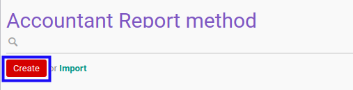

# Membuat Accountant Report Method

## A. INPUT

*(Tidak ada instruksi khusus)*

## B. LANGKAH KERJA

1. Buka menu **Accountant Report -> Configuration -> Accountant Report Method**. Abaikan jika sudah berada pada menu yang dimaksud.
2. Klik tombol **Create** pada bagian atas-kiri form.

3. Isi **[Method](./penjelasan.md#field-method)**. Wajib diisi.
4. Isi **[Code](./penjelasan.md#field-code)**. Wajib diisi.
5. Aktifkan/ Deaktifkan **[Active](./penjelasan.md#field-active)**. Tidak wajib diisi.
6. Isi **[Description](./penjelasan.md#field-description)**. Tidak wajib diisi.
7. Klik tombol **Save** pada bagian atas-kiri form.

## C. OUTPUT

* Data *Accountant Report Method* akan terbuat.
