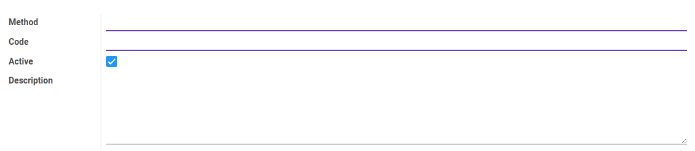

# Penjelasan Accountant Report Method

Informasi pada *Accountant Report Method* dibagi menjadi beberapa bagian, yaitu:

* [Header](#bagian-header)

### <a name="bagian-header">HEADER</a>

#### <a name="field-method">Method</a>

Metode.

#### <a name="field-code">Code</a>

Kode metode.

#### <a name="field-active">Active</a>

Penanda status accountant report method aktif.

#### <a name="field-description">Description</a>

Deskripsi.
