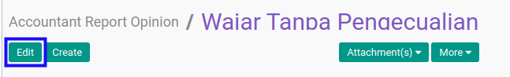

# Memodifikasi Accountant Report Opinion

## A. INPUT

* User yang akan memodifikasi harus memiliki akses untuk memodifikasi konfigurasi *Accountant Report Opinion*.

## B. LANGKAH KERJA

1. Buka menu **Accountant Report -> Configuration -> Accountant Report Opinion**. Abaikan jika sudah berada pada menu yang dimaksud.
2. Buka data *Accountant Report Opinion* yang akan dimodifikasi. Abaikan jika data sudah dibuka.
3. Klik tombol **Edit** pada bagian atas-kiri form.

4. Isi dan sesuaikan **[Opinion](./penjelasan.md#field-opinion)** jika dibutuhkan. Wajib diisi.
5. Isi dan sesuaikan **[Code](./penjelasan.md#field-code)** jika dibutuhkan. Wajib diisi.
6. Aktifkan/ Deaktifkan **[Active](./penjelasan.md#field-active)** jika dibutuhkan. Tidak wajib diisi.
7. Isi dan sesuaikan **[Description](./penjelasan.md#field-description)** jika dibutuhkan. Tidak wajib diisi.
8. Klik tombol **Save** pada bagian atas-kiri form.

## C. OUTPUT

* Data *Accountant Report Opinion* akan berubah sesuai dengan perubahan yang dilakukan.
