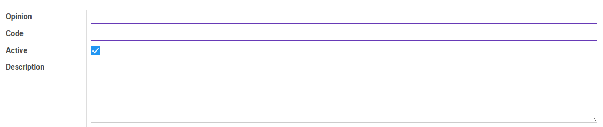

# Penjelasan Accountant Report Opinion

Informasi pada *Accountant Report Opinion* dibagi menjadi beberapa bagian, yaitu:

* [Header](#bagian-header)

### <a name="bagian-header">HEADER</a>

#### <a name="field-opinion">Opinion</a>

Opini.

#### <a name="field-code">Code</a>

Kode opini.

#### <a name="field-active">Active</a>

Penanda status accountant report opinion aktif.

#### <a name="field-description">Description</a>

Deskripsi.
