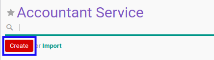

# Membuat Accountant Service

## A. INPUT

*(Tidak ada instruksi khusus)*

## B. LANGKAH KERJA

1. Buka menu **Accountant Report -> Configuration -> Accountant Service**. Abaikan jika sudah berada pada menu yang dimaksud.
2. Klik tombol **Create** pada bagian atas-kiri form.

3. Isi **[Name](./penjelasan.md#field-name)**. Wajib diisi.
4. Isi **[Internal Reference](./penjelasan.md#field-internal-ref)**. Tidak wajib diisi.
5. Aktifkan/ Deaktifkan **[Active](./penjelasan.md#field-active)**. Tidak wajib diisi.
6. Aktifkan/ Deaktifkan **[Assurance Service](./penjelasan.md#field-assurance-service)**. Tidak wajib diisi.
7. Isi **[Code](./penjelasan.md#field-code)**. Tidak wajib diisi.
8. Pilih **[Sequence Creation Method](./penjelasan.md#field-sequence-creation)**. Wajib diisi.
9. Beralih ke tab **[Python Code](./penjelasan.md#tab-python-code)**.
10. Isi **[Python Code for Custom Sequence Generation](./penjelasan.md#field-python-code)**. Tidak wajib diisi.
11. Beralih ke tab **[Signing Partner](./penjelasan.md#tab-signing-partner)**.
12. <a name="l12">[Tambah](./menambahkan-signing-partner.md)/[Modifikasi](./memodifikasi-signing-partner.md)/[Hapus](./menghapus-signing-partner.md) **Signing Partner**</a>. Ulangi langkah ini sampai **Signing Partner** sesuai dengan keinginan.
13. Beralih ke tab **[Opinions](./penjelasan.md#tab-opinions)**.
14. Aktifkan/ Deaktifkan **[Opinion Required](./penjelasan.md#field-opinion-required)**. Tidak wajib diisi.
15. <a name="l15">[Tambah](./menambahkan-opini.md)/[Hapus](./menghapus-opini.md) **Opinion**</a>. Ulangi langkah ini sampai **Opinion** sesuai dengan keinginan.
16. Beralih ke tab **[Quality Control](./penjelasan.md#tab-quality-control)**.
17. <a name="l17">[Tambah](./menambahkan-pertanyaan.md)/[Modifikasi](./memodifikasi-pertanyaan.md)/[Hapus](./menghapus-pertanyaan.md) **Question**</a>. Ulangi langkah ini sampai **Question** sesuai dengan keinginan.
18. Beralih ke tab **[Methods](./penjelasan.md#tab-methods)**.
19. Aktifkan/ Deaktifkan **[Method Required](./penjelasan.md#field-method-required)**. Tidak wajib diisi.
20. <a name="l20">[Tambah](./menambahkan-method.md)/[Hapus](./menghapus-method.md) **Method**</a>. Ulangi langkah ini sampai **Method** sesuai dengan keinginan.
21. Beralih ke tab **[Policy](./penjelasan.md#tab-policy)**.
22. Pilih **[Allowed To Confirm](./penjelasan.md#field-allowed-confirm)**. Tidak wajib diisi.
23. Pilih **[Allowed To Validate](./penjelasan.md#field-allowed-validate)**. Tidak wajib diisi.
24. Pilih **[Allowed To Cancel](./penjelasan.md#field-allowed-cancel)**. Tidak wajib diisi.
25. Pilih **[Allowed To Restart](./penjelasan.md#field-allowed-restart)**. Tidak wajib diisi.
26. Isi **[Description](./penjelasan.md#field-description)**. Tidak wajib diisi.
27. Klik tombol **Save** pada bagian atas-kiri form.

## C. OUTPUT

* Data *Accountant Service* akan terbuat.
