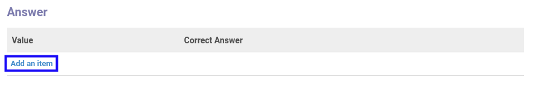

# Menambahkan Jawaban

*(Instruksi kerja ini merupakan sub instruksi dari (1) [Menambahkan Pertanyaan](./menambahkan-pertanyaan.md), atau (2) [Memodifikasi Pertanyaan](./memodifikasi-pertanyaan.md). Instruksi kerja ini tidak bisa berdiri sendiri)*

## A. INPUT

*(Tidak ada instruksi khusus)*

## B. LANGKAH KERJA

1. Klik label **Add an Item** pada bagian atas-kiri tabel ***Answer***

2. Isi **[Value](./penjelasan.md#field-value)**. Wajib diisi.
3. Aktifkan/ Deaktifkan **[Correct Answer](./penjelasan.md#field-correct-answer)**. Tidak wajib diisi.
4. Klik tombol **Save & Close** pada bagian bawah-kiri pop-up **Answer** untuk menyimpan data. Klik tombol **Save & New** pada bagian bawah-kiri pop-up **Answer** untuk menyimpan data dan menambahkan data baru.

5. Ulangi mulai langkah ke-1 jika pada langkah ke-4 tombol **Save & New** yang dipilih.
6. Lanjutkan [langkah ke-5 instruksi kerja Menambahkan Pertanyaan](./menambahkan-pertanyaan.md#l5) atau [langkah ke-5 instruksi kerja Memodifikasi Pertanyaan](./memodifikasi-pertanyaan.md#l5).

## C. OUTPUT

*(Tidak ada instruksi khusus)*
