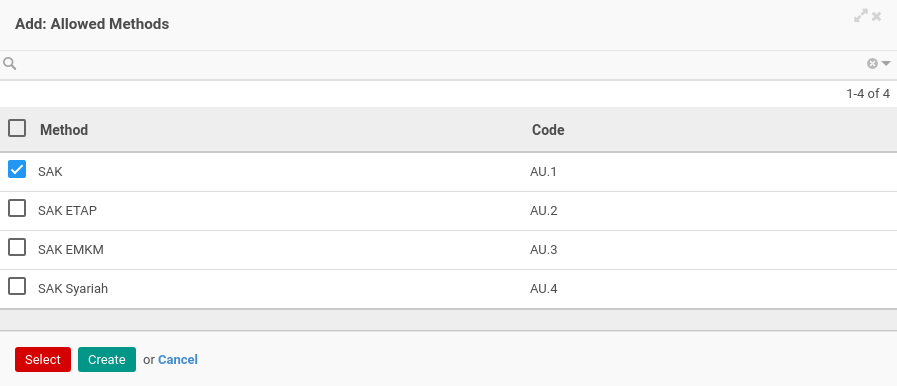

# Menambahkan Method

*(Instruksi kerja ini merupakan sub instruksi dari (1) [Membuat Accountant Service](./membuat.md), atau (2) [Memodifikasi Accountant Service](./memodifikasi.md). Instruksi kerja ini tidak bisa berdiri sendiri)*

## A. INPUT

*(Tidak ada instruksi khusus)*

## B. LANGKAH KERJA

1. Klik label **Add an Item** pada bagian atas-kiri tabel ***Method***

Pop-up ***Allowed Methods*** akan muncul.

2. Seleksi data *Method*.
3. Klik tombol **Select** pada bagian bawah-kiri pop-up ***Allowed Methods***

4. Lanjutkan [langkah ke-20 instruksi kerja Membuat Accountant Service](./membuat.md#l20) atau [langkah ke-21 instruksi kerja Memodifikasi Accountant Service](./memodifikasi.md#l21).

## C. OUTPUT

*(Tidak ada instruksi khusus)*
