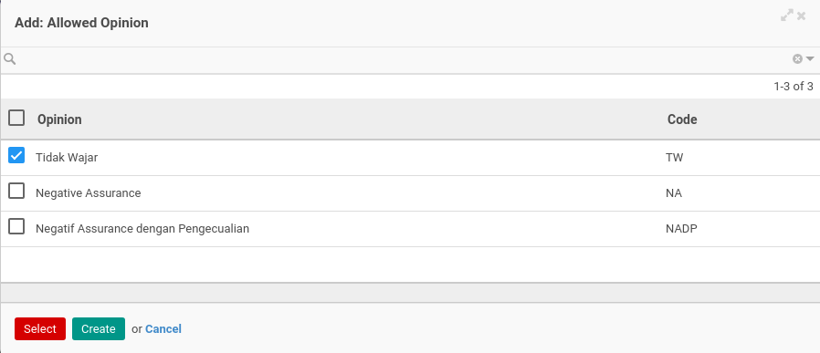

# Menambahkan Opini

*(Instruksi kerja ini merupakan sub instruksi dari (1) [Membuat Accountant Service](./membuat.md), atau (2) [Memodifikasi Accountant Service](./memodifikasi.md). Instruksi kerja ini tidak bisa berdiri sendiri)*

## A. INPUT

*(Tidak ada instruksi khusus)*

## B. LANGKAH KERJA

1. Klik label **Add an Item** pada bagian atas-kiri tabel ***Opinion***

Pop-up ***Allowed Opinion*** akan muncul.

2. Seleksi data *Opinion*.
3. Klik tombol **Select** pada bagian bawah-kiri pop-up ***Allowed Opinion***

4. Lanjutkan [langkah ke-15 instruksi kerja Membuat Accountant Service](./membuat.md#l15) atau [langkah ke-16 instruksi kerja Memodifikasi Accountant Service](./memodifikasi.md#l16).

## C. OUTPUT

*(Tidak ada instruksi khusus)*
