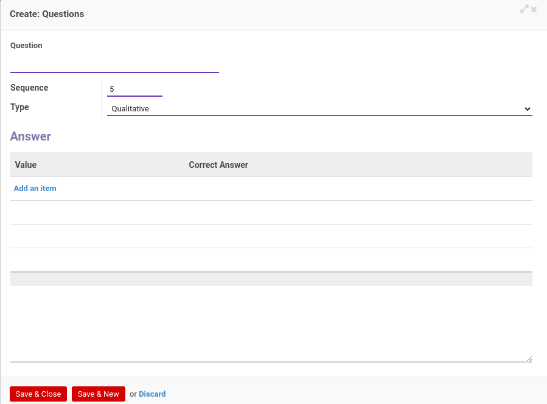

# Menambahkan Pertanyaan

*(Instruksi kerja ini merupakan sub instruksi dari (1) [Membuat Accountant Service](./membuat.md), atau (2) [Memodifikasi Accountant Service](./memodifikasi.md). Instruksi kerja ini tidak bisa berdiri sendiri)*

## A. INPUT

*(Tidak ada instruksi khusus)*

## B. LANGKAH KERJA

1. Klik label **Add an Item** pada bagian atas-kiri tabel ***Question***

Pop-up ***Questions*** akan muncul.

2. Isi **[Question](./penjelasan.md#field-question)**. Wajib diisi.
3. Isi **[Sequence](./penjelasan.md#field-question-sequence)**. Wajib diisi.
4. Pilih **[Type](./penjelasan.md#field-question-type)**. Wajib diisi.
5. <a name="l5">[Tambah](./menambahkan-jawaban.md)/[Modifikasi](./memodifikasi-jawaban.md)/[Hapus](./menghapus-jawaban.md) **Answer**</a> untuk pilihan *Type* *Qualitative*. Ulangi langkah ini sampai **Answer** sesuai dengan keinginan.
6. Isi nilai minimum dan maksimum untuk pilihan *Type* *Quantitative*. Wajib diisi.
7. Klik tombol **Save & Close** pada bagian bawah-kiri pop-up **Question** untuk menyimpan data. Klik tombol **Save & New** pada bagian bawah-kiri pop-up **Question** untuk menyimpan data dan menambahkan data baru.

8. Ulangi langkah ke-2 jika pada langkah ke-7 tombol **Save & New** yang dipilih.
9. Lanjutkan [langkah ke-17 instruksi kerja Membuat Accountant Service](./membuat.md#l17) atau [langkah ke-18 instruksi kerja Memodifikasi Accountant Service](./memodifikasi.md#l18).

## C. OUTPUT

*(Tidak ada instruksi khusus)*
