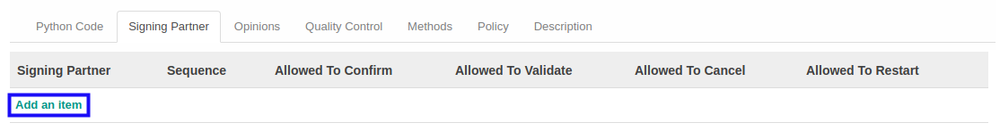
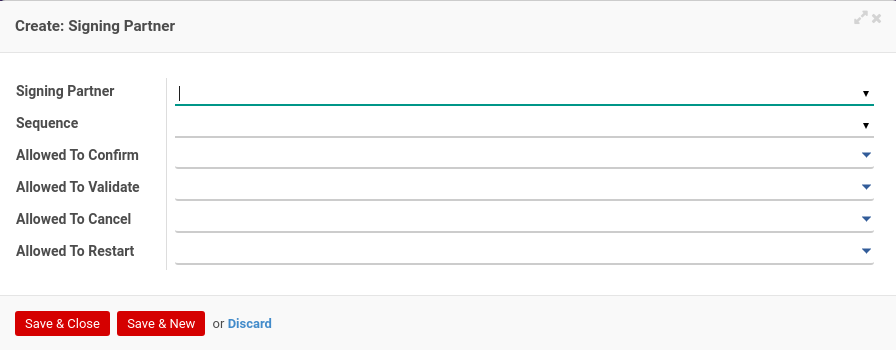

# Menambahkan Signing Partner

*(Instruksi kerja ini merupakan sub instruksi dari (1) [Membuat Accountant Service](./membuat.md), atau (2) [Memodifikasi Accountant Service](./memodifikasi.md). Instruksi kerja ini tidak bisa berdiri sendiri)*

## A. INPUT

*(Tidak ada instruksi khusus)*

## B. LANGKAH KERJA

1. Klik label **Add an Item** pada bagian atas-kiri tabel ***Signing Partner***

Pop-up ***Signing Partner*** akan muncul.

2. Pilih **[Signing Partner](./penjelasan.md#field-signing-partner)**. Wajib diisi.
3. Pilih **[Sequence](./penjelasan.md#field-sequence)**. Tidak wajib diisi.
4. Pilih **[Allowed To Confirm](./penjelasan.md#field-allowed-to-confirm)**. Tidak wajib diisi.
5. Pilih **[Allowed To Validate](./penjelasan.md#field-allowed-to-validate)**. Tidak wajib diisi.
6. Pilih **[Allowed To Cancel](./penjelasan.md#field-allowed-to-cancel)**. Tidak wajib diisi.
7. Pilih **[Allowed To Restart](./penjelasan.md#field-allowed-to-restart)**. Tidak wajib diisi.
8. Klik tombol **Save & Close** pada bagian bawah-kiri pop-up **Signing Partner** untuk menyimpan data. Klik tombol **Save & New** pada bagian bawah-kiri pop-up **Signing Partner** untuk menyimpan data dan menambahkan data baru.

9. Ulangi langkah ke-2 jika pada langkah ke-8 tombol **Save & New** yang dipilih.
10. Lanjutkan [langkah ke-12 instruksi kerja Membuat Accountant Service](./membuat.md#l12) atau [langkah ke-13 instruksi kerja Memodifikasi Accountant Service](./memodifikasi.md#l13).

## C. OUTPUT

*(Tidak ada instruksi khusus)*
