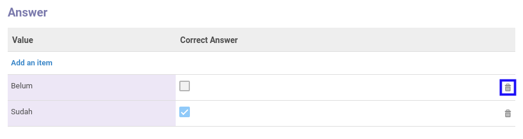

# Menghapus Jawaban

*(Instruksi kerja ini merupakan sub instruksi dari (1) [Menambahkan Pertanyaan](./menambahkan-pertanyaan.md), atau (2) [Memodifikasi Pertanyaan](./memodifikasi-pertanyaan.md). Instruksi kerja ini tidak bisa berdiri sendiri)*

## A. INPUT

*(Tidak ada instruksi khusus)*

## B. LANGKAH KERJA

1. Klik icon tempat sampah pada bagian kanan **Answer** yang akan dihapus.

2. Ulangi langkah ke-1 untuk setiap **Answer** yang akan dihapus.
3. Lanjutkan [langkah ke-5 instruksi kerja Menambahkan Pertanyaan](./menambahkan-pertanyaan.md#l5) atau [langkah ke-5 instruksi kerja Memodifikasi Pertanyaan](./memodifikasi-pertanyaan.md#l5).

## C. OUTPUT

*(Tidak ada instruksi khusus)*
