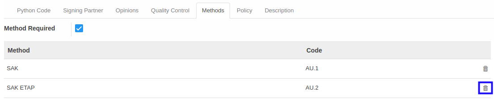

# Menghapus Method

*(Instruksi kerja ini merupakan sub instruksi dari (1) [Membuat Accountant Service](./membuat.md), atau (2) [Memodifikasi Accountant Service](./memodifikasi.md). Instruksi kerja ini tidak bisa berdiri sendiri)*

## A. INPUT

*(Tidak ada instruksi khusus)*

## B. LANGKAH KERJA

1. Klik icon tempat sampah pada bagian kanan **Method** yang akan dihapus.

2. Ulangi langkah ke-1 untuk setiap **Method** yang akan dihapus.
3. Lanjutkan [langkah ke-20 instruksi kerja Membuat Accountant Service](./membuat.md#l20) atau [langkah ke-21 instruksi kerja Memodifikasi Accountant Service](./memodifikasi.md#l21).

## C. OUTPUT

*(Tidak ada instruksi khusus)*
