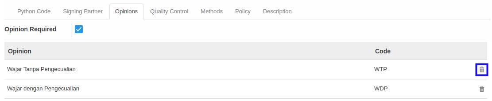

# Menghapus Opini

*(Instruksi kerja ini merupakan sub instruksi dari (1) [Membuat Accountant Service](./membuat.md), atau (2) [Memodifikasi Accountant Service](./memodifikasi.md). Instruksi kerja ini tidak bisa berdiri sendiri)*

## A. INPUT

*(Tidak ada instruksi khusus)*

## B. LANGKAH KERJA

1. Klik icon tempat sampah pada bagian kanan **Opinion** yang akan dihapus.

2. Ulangi langkah ke-1 untuk setiap **Opinion** yang akan dihapus.
3. Lanjutkan [langkah ke-15 instruksi kerja Membuat Accountant Service](./membuat.md#l15) atau [langkah ke-16 instruksi kerja Memodifikasi Accountant Service](./memodifikasi.md#l16).

## C. OUTPUT

*(Tidak ada instruksi khusus)*
