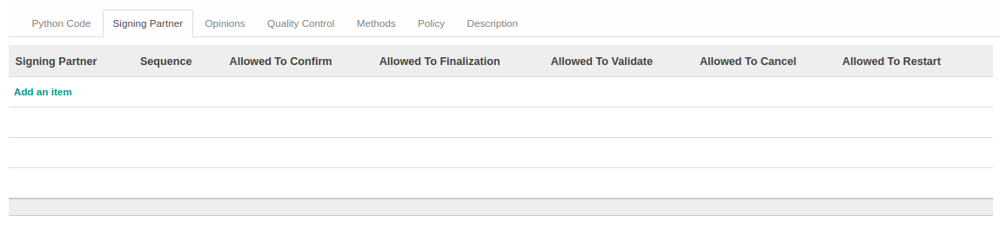
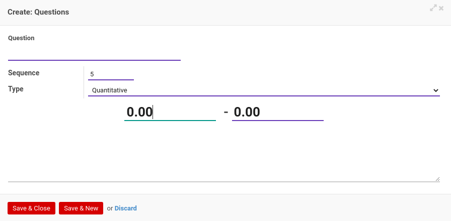

# Penjelasan Accountant Service

Informasi pada *Accountant Service* dibagi menjadi beberapa bagian, yaitu:

* [Header](#bagian-header)
* [Tab Python Code](#tab-python-code)
* [Tab Signing Partner](#tab-signing-partner)
* [Tab Opinions](#tab-opinions)
* [Tab Quality Control](#tab-quality-control)
* [Tab Methods](#tab-methods)
* [Tab Policy](#tab-policy)
* [Tab Description](#tab-description)

### <a name="bagian-header">HEADER</a>

#### <a name="field-name">Name</a>

Nama accountant service.

#### <a name="field-internal-ref">Internal Reference</a>

Nomor referensi Internal.

#### <a name="field-active">Active</a>

Penanda status accountant service aktif.

#### <a name="field-assurance-service">Assurance Service</a>

Penanda status assurance service aktif.

#### <a name="field-code">Code</a>

Kode accountant service.

#### <a name="field-sequence-creation">Sequence Creation Method</a>

Metode nomor urut pembuatan accountant service. Metode terdiri dari 2 (dua) pilihan, yaitu:

1. *Standard*. Nomor urut ditentukan secara standar.
2. *Python Code*. Nomor urut ditentukan secara kustom berdasarkan kode Python.

#### <a name="tab-python-code">TAB PYTHON CODE</a>

#### <a name="field-python-code">Python Code for Custom Sequence Generation</a>

Kode Python untuk membuat nomor urut yang diinginkan.

#### <a name="tab-signing-partner">TAB SIGNING PARTNER</a>

*Pop Up Signing Partner* saat *add an item* diklik.

#### <a name="field-signing-partner">Signing Partner</a>

Partner yang ditunjuk.

#### <a name="field-sequence">Sequence</a>

Nomor urut.

#### <a name="field-allowed-to-confirm">Allowed To Confirm</a>

Berhak/tidaknya user aktif untuk dapat mengkonfirmasi accountant service.

#### <a name="field-allowed-to-validate">Allowed To Validate</a>

Berhak/tidaknya user aktif untuk dapat memvalidasi accountant service.

#### <a name="field-allowed-to-cancel">Allowed To Cancel</a>

Berhak/tidaknya user aktif untuk dapat membatalkan accountant service.

#### <a name="field-allowed-to-restart">Allowed To Restart</a>

Berhak/tidaknya user aktif untuk dapat merestart accountant service.

#### <a name="tab-opinions">TAB OPINIONS</a>

#### <a name="field-opinion-required">Opinion Required</a>

Penanda dibutuhkan opinion aktif.

#### <a name="tab-quality-control">TAB QUALITY CONTROL</a>

*Pop Up Questions* saat *add an item* diklik.

#### <a name="field-question">Question</a>

Item pertanyaan untuk kontrol kualitas.

#### <a name="field-question-sequence">Sequence</a>

Urutan pertanyaan.

#### <a name="field-question-type">Type</a>

Tipe jawaban untuk kontrol kualitas (kuantitatif atau kualitatif).

***Type Quantitative***

#### <a name="field-min-value">Min. Value</a>

Nilai minimum jawaban.

#### <a name="field-max-value">Max. Value</a>

Nilai maksimum jawaban.

***Type Qualitative***

#### <a name="field-value">Value</a>

Jawaban.

#### <a name="field-correct-answer">Correct Answer</a>

Penanda jawaban yang benar.

#### <a name="tab-methods">TAB METHODS</a>

#### <a name="field-method-required">Method Required</a>

Penanda dibutuhkan metode aktif.

#### <a name="tab-policy">TAB POLICY</a>

#### <a name="field-allowed-confirm">Allowed To Confirm</a>

Berhak/tidaknya user aktif untuk dapat mengkonfirmasi accountant service.

#### <a name="field-allowed-validate">Allowed To Validate</a>

Berhak/tidaknya user aktif untuk dapat memvalidasi accountant service.

#### <a name="field-allowed-cancel">Allowed To Cancel</a>

Berhak/tidaknya user aktif untuk dapat membatalkan accountant service.

#### <a name="field-allowed-restart">Allowed To Restart</a>

Berhak/tidaknya user aktif untuk dapat merestart accountant service.

#### <a name="tab-description">TAB DESCRIPTION</a>

#### <a name="field-description">Description</a>

Deskripsi accountant service.
