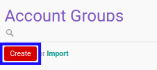

# Membuat Account Group

## A. INPUT

*(Tidak ada instruksi khusus)*

## B. LANGKAH KERJA

1. Buka menu **Accountant Service -> Configuration -> General Audit -> Trial Balance -> Account Groups**. Abaikan jika sudah berada pada menu yang dimaksud.
2. Klik tombol **Create** pada bagian atas-kiri form.

3. Isi **[Name](./penjelasan.md#field-name)**. Wajib diisi.
4. Isi **[Code](./penjelasan.md#field-code)**. Wajib diisi.
5. Isi **[Sequence](./penjelasan.md#field-sequence)**. Wajib diisi.
6. Beralih ke tab **[Description](./penjelasan.md#tab-description)**.
7. Isi **[Description](./penjelasan.md#field-description)**. Tidak wajib diisi.
8. Klik tombol **Save** pada bagian atas-kiri form.

## C. OUTPUT

*(Tidak ada instruksi khusus)*
