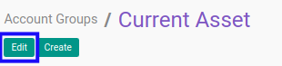
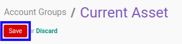

# Memodifikasi Account Group

## A. INPUT

* User yang akan memodifikasi harus memiliki akses untuk memodifikasi konfigurasi *Account Group*.

## B. LANGKAH KERJA

1. Buka menu **Accountant Service -> Configuration -> General Audit -> Trial Balance -> Account Groups**. Abaikan jika sudah berada pada menu yang dimaksud.
2. Buka data *Account Group* yang akan dimodifikasi. Abaikan jika data sudah dibuka.
3. Klik tombol **Edit** pada bagian atas-kiri form.

4. Isi dan sesuaikan **[Name](./penjelasan.md#field-name)** jika dibutuhkan. Wajib diisi.
5. Isi dan sesuaikan **[Code](./penjelasan.md#field-code)** jika dibutuhkan. Wajib diisi.
6. Isi dan sesuaikan **[Sequence](./penjelasan.md#field-sequence)** jika dibutuhkan. Wajib diisi.
7. Beralih ke tab **[Description](./penjelasan.md#tab-description)**.
8. Isi dan sesuaikan **[Description](./penjelasan.md#field-description)** jika dibutuhkan. Tidak wajib diisi.
9. Klik tombol **Save** pada bagian atas-kiri form.

## C. OUTPUT

* Data *Account Group* akan berubah sesuai dengan perubahan yang dilakukan.
