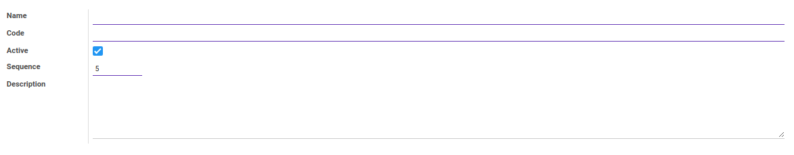

# Penjelasan Account Group

Informasi pada *Account Group* dibagi menjadi beberapa bagian, yaitu:

* [Header](#bagian-header)
* [Tab Description](#tab-description)

### <a name="bagian-header">HEADER</a>

#### <a name="field-name">Name</a>

Nama kelompok akun.

#### <a name="field-code">Code</a>

Kode kelompok akun.

#### <a name="field-active">Active</a>

Penanda status kelompok akun aktif.

#### <a name="field-sequence">Sequence</a>

Nomor urut.

#### <a name="tab-description">TAB DESCRIPTION</a>

#### <a name="field-description">Description</a>

Deskripsi.
