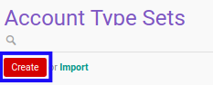

# Membuat Account Type Set

## A. INPUT

*(Tidak ada instruksi khusus)*

## B. LANGKAH KERJA

1. Buka menu **Accountant Service -> Configuration -> General Audit -> Trial Balance -> Account Type Sets**. Abaikan jika sudah berada pada menu yang dimaksud.
2. Klik tombol **Create** pada bagian atas-kiri form.

3. Isi **[Account Type Set](./penjelasan.md#field-account-type-set)**. Wajib diisi.
4. Isi **[Code](./penjelasan.md#field-code)**. Wajib diisi.
5. Beralih ke tab **[Account Types](./penjelasan.md#tab-account-types)**.
6. <a name="l6">[Tambah](./menambahkan-account-type.md)/[Hapus](./menghapus-account-type.md) **Account Types**</a>. Ulangi langkah ini sampai **Account Types** sesuai dengan keinginan.
7. Beralih ke tab **[Sequence](./penjelasan.md#tab-sequence)**.
8. Pilih **[General Audit](./penjelasan.md#field-general-audit)**. Tidak wajib diisi.
9. Pilih **[Index A1101 Sequence](./penjelasan.md#field-index-a1101-sequence)**. Tidak wajib diisi.
10. Pilih **[Index 1102 Sequence](./penjelasan.md#field-index-1102-sequence)**. Tidak wajib diisi.
11. Pilih **[Index A11021 Sequence](./penjelasan.md#field-index-a11021-sequence)**. Tidak wajib diisi.
12. Pilih **[Index 1104 Sequence](./penjelasan.md#field-index-1104-sequence)**. Tidak wajib diisi.
13. Pilih **[Index A.230.4](./penjelasan.md#field-index-a-230-4)**. Tidak wajib diisi.
14. Pilih **[Index A.230.6](./penjelasan.md#field-index-a-230-6)**. Tidak wajib diisi.
15. Pilih **[Index A.230.8](./penjelasan.md#field-index-a-230-8)**. Tidak wajib diisi.
16. Pilih **[Index A.230.5](./penjelasan.md#field-index-a-230-5)**. Tidak wajib diisi.
17. Pilih **[Trial Balance](./penjelasan.md#field-trial-balance)**. Tidak wajib diisi.
18. Pilih **[Adjustment Entry](./penjelasan.md#field-adjustment-entry)**. Tidak wajib diisi.
19. Beralih ke tab **[Computation](./penjelasan.md#tab-computation)**.
20. <a name="l20">[Tambah](./menambahkan-komputasi.md)/[Hapus](./menghapus-komputasi.md) **Computation**</a>. Ulangi langkah ini sampai **Computation** sesuai dengan keinginan.
21. Beralih ke tab **[Workflow](./penjelasan.md#tab-workflow)**.
22. Pilih **[Allow To Confirm Account Type Set](./penjelasan.md#field-allow-confirm-account-type)**. Tidak wajib diisi.
23. Pilih **[Allow To Restart Approval Account Type Set](./penjelasan.md#field-allow-restart-approval-account-type)**. Tidak wajib diisi.
24. Pilih **[Allow To Cancel Account Type Set](./penjelasan.md#field-allow-cancel-account-type)**. Tidak wajib diisi.
25. Pilih **[Allow To Restart Account Type Set](./penjelasan.md#field-allow-restart-account-type)**. Tidak wajib diisi.
26. Pilih **[Allow To Confirm Accountant General Audit](./penjelasan.md#field-allow-confirm-general-audit)**. Tidak wajib diisi.
27. Pilih **[Allow To Restart Validation Accountant General Audit](./penjelasan.md#field-allow-restart-validation-general-audit)**. Tidak wajib diisi.
28. Pilih **[Allow To Cancel Accountant General Audit](./penjelasan.md#field-allow-cancel-general-audit)**. Tidak wajib diisi.
29. Pilih **[Allow To Restart Accountant General Audit](./penjelasan.md#field-allow-restart-general-audit)**. Tidak wajib diisi.
30. Beralih ke tab **[Descripton](./penjelasan.md#tab-description)**.
31. Isi **[Description](./penjelasan.md#field-description)**. Tidak wajib diisi.
32. Beralih ke tab **[Index A.230.3](./penjelasan.md#tab-index-a-230-3)**.
33. Pilih **[Index A.230.3 Sequence](./penjelasan.md#field-index-a-230-3-sequence)**. Tidak wajib diisi.
34. Beralih ke tab **[Index A.220.1](./penjelasan.md#tab-index-a-220-1)**.
35. Pilih **[Index A.220.1 Sequence](./penjelasan.md#field-index-a-220-1-sequence)**. Tidak wajib diisi.
36. Beralih ke tab **[Index A.210.1](./penjelasan.md#tab-index-a-210-1)**.
37. Pilih **[Index A.210.1 Sequence](./penjelasan.md#field-index-a-210-1-sequence)**. Tidak wajib diisi.
38. Beralih ke tab **[Index 210](./penjelasan.md#tab-index-210)**.
39. Isi **[Total Asset](./penjelasan.md#field-total-asset)**. Tidak wajib diisi.
40. Isi **[Net Asset](./penjelasan.md#field-net-asset)**. Tidak wajib diisi.
41. Isi **[Revenue](./penjelasan.md#field-revenue)**. Tidak wajib diisi.
42. Isi **[Cost of Revenue](./penjelasan.md#field-cost-of-revenue)**. Tidak wajib diisi.
43. Isi **[EBT](./penjelasan.md#field-ebt)**. Tidak wajib diisi.
44. Isi **[EBITDA](./penjelasan.md#field-ebitda)**. Tidak wajib diisi.
45. Isi **[Total Liability](./penjelasan.md#field-total-liability)**. Tidak wajib diisi.
46. Beralih ke tab **[Index A.130](./penjelasan.md#tab-index-a-130)**.
47. Pilih **[Index A.130 Sequence](./penjelasan.md#field-index-a-130-sequence)**. Tidak wajib diisi.
48. Beralih ke tab **[Index A.220.2](./penjelasan.md#tab-index-a-220-2)**.
49. Pilih **[Index A.220.2 Sequence](./penjelasan.md#field-index-a-220-2-sequence)**. Tidak wajib diisi.
50. Klik tombol **Save** pada bagian atas-kiri form.

## C. OUTPUT

*(Tidak ada instruksi khusus)*
