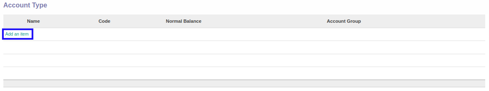
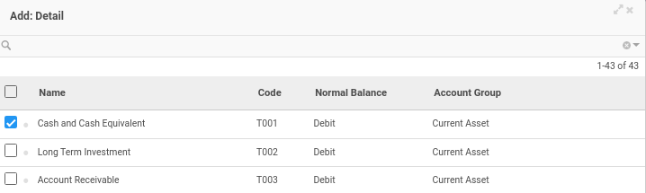
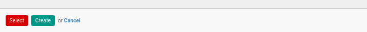
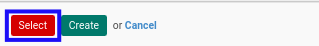

# Menambahkan Account Type

*(Instruksi kerja ini merupakan sub instruksi dari (1) [Membuat Account Type Set](./membuat.md), atau (2) [Memodifikasi Account Type Set](./memodifikasi.md). Instruksi kerja ini tidak bisa berdiri sendiri)*

## A. INPUT

*(Tidak ada instruksi khusus)*

## B. LANGKAH KERJA

1. Klik label **Add an Item** pada bagian atas-kiri tabel ***Account Type***

Pop-up ***Detail*** akan muncul.

2. Seleksi data account type.
3. Klik tombol **Select** pada bagian bawah-kiri pop-up ***Detail***

4. Lanjutkan [langkah ke-6 instruksi kerja Membuat Account Type Set](./membuat.md#l6) atau [langkah ke-7 instruksi kerja Memodifikasi Account Type Set](./memodifikasi.md#l7).

## C. OUTPUT

*(Tidak ada instruksi khusus)*
