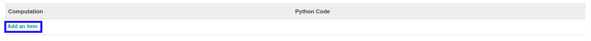

# Menambahkan Komputasi

*(Instruksi kerja ini merupakan sub instruksi dari (1) [Membuat Account Type Set](./membuat.md), atau (2) [Memodifikasi Account Type Set](./memodifikasi.md). Instruksi kerja ini tidak bisa berdiri sendiri)*

## A. INPUT

*(Tidak ada instruksi khusus)*

## B. LANGKAH KERJA

1. Klik label **Add an Item** pada bagian atas-kiri tabel ***Computation***

2. Isi **[Computation](./penjelasan.md#field-computation)**. Wajib diisi.
3. Isi **[Python Code](./penjelasan.md#field-python-code)**. Tidak wajib diisi.
4. Lanjutkan [langkah ke-20 instruksi kerja Membuat Account Type Set](./membuat.md#l20) atau [langkah ke-21 instruksi kerja Memodifikasi Account Type Set](./memodifikasi.md#l21).

## C. OUTPUT

*(Tidak ada instruksi khusus)*
