# Penjelasan Account Type Set

Informasi pada *Account Type Set* dibagi menjadi beberapa bagian, yaitu:

* [Header](#bagian-header)
* [Tab Account Types](#tab-account-types)
* [Tab Sequence](#tab-sequence)
* [Tab Computation](#tab-computation)
* [Tab Workflow](#tab-workflow)
* [Tab Description](#tab-description)
* [Tab Index A.230.3](#tab-index-a-230-3)
* [Tab Index A.220.1](#tab-index-a-220-1)
* [Tab Index A.210.1](#tab-index-a-210-1)
* [Tab Index A.210](#tab-index-a-210)
* [Tab Index A.130](#tab-index-a-130)
* [Tab Index A.220.2](#tab-index-a-220-2)

### <a name="bagian-header">HEADER</a>

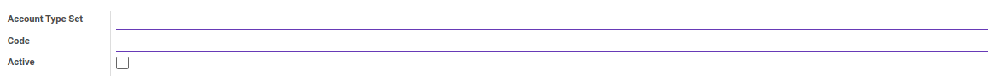

#### <a name="field-account-type-set">Account Type Set</a>

Nama Set Tipe Akun.

#### <a name="field-code">Code</a>

Kode Set Tipe Akun.

#### <a name="field-active">Active</a>

Penanda status set tipe akun aktif.

#### <a name="tab-account-types">TAB ACCOUNT TYPES</a>

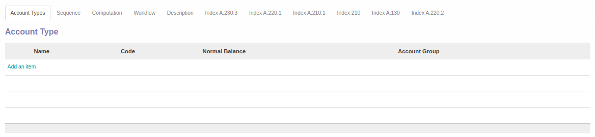

#### <a name="field-name">Name</a>

Nama tipe akun.

#### <a name="field-account-type-code">Code</a>

Kode tipe akun.

#### <a name="field-normal-balance">Normal Balance</a>

Saldo Normal yang digunakan.

#### <a name="field-account-group">Account Group</a>

Kelompok Akun.

#### <a name="tab-sequence">TAB SEQUENCE</a>

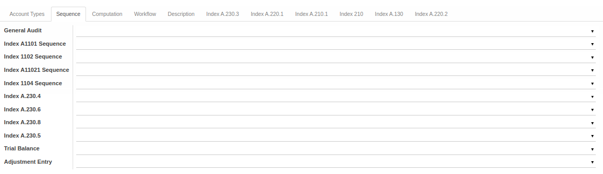

#### <a name="field-general-audit">General Audit</a>

Urutan general audit yang digunakan.

#### <a name="field-index-a1101-sequence">Index A1101 Sequence</a>

Urutan index A1101 yang digunakan.

#### <a name="field-index-1102-sequence">Index 1102 Sequence</a>

Urutan index 1102 yang digunakan.

#### <a name="field-index-a11021-sequence">Index A11021 Sequence</a>

Urutan index A11021 yang digunakan.

#### <a name="field-index-1104-sequence">Index 1104 Sequence</a>

Urutan index 1104 yang digunakan.

#### <a name="field-index-a-230-4">Index A.230.4</a>

Urutan index A.230.4 yang digunakan.

#### <a name="field-index-a-230-6">Index A.230.6</a>

Urutan index A.230.6 yang digunakan.

#### <a name="field-index-a-230-8">Index A.230.8</a>

Urutan index A.230.8 yang digunakan.

#### <a name="field-index-a-230-5">Index A.230.5</a>

Urutan index A.230.5 yang digunakan.

#### <a name="field-trial-balance">Trial Balance</a>

Urutan trial balance yang digunakan.

#### <a name="field-adjustment-entry">Adjustment Entry</a>

Urutan adjustment entry digunakan.

#### <a name="tab-computation">TAB COMPUTATION</a>

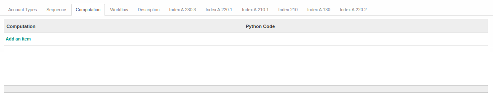

#### <a name="field-computation">Computation</a>

Item yang akan dilakukan komputasi.

#### <a name="field-python-code">Python Code</a>

Kode python untuk melakukan komputasi.

#### <a name="tab-workflow">TAB WORKFLOW</a>

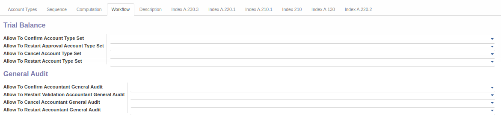

**TRIAL BALANCE**

#### <a name="field-allow-confirm-account-type">Allow To Confirm Account Type Set</a>

Berhak/tidaknya user untuk dapat mengkonfirmasi set tipe akun.

#### <a name="field-allow-restart-approval-account-type">Allow To Restart Approval Account Type Set</a>

Berhak/tidaknya user untuk dapat menrestart persetujuan set tipe akun.

#### <a name="field-allow-cancel-account-type">Allow To Cancel Account Type Set</a>

Berhak/tidaknya user untuk dapat membatalkan set tipe akun.

#### <a name="field-allow-restart-account-type">Allow To Restart Account Type Set</a>

Berhak/tidaknya user untuk dapat merestart set tipe akun.

#### <a name="field-allow-confirm-general-audit">Allow To Confirm Accountant General Audit</a>

**GENERAL AUDIT**

Berhak/tidaknya user untuk dapat mengkonfirmasi accountant general audit.

#### <a name="field-allow-restart-validation-general-audit">Allow To Restart Validation Accountant General Audit</a>

Berhak/tidaknya user untuk dapat merestart persetujuan accountant general audit.

#### <a name="field-allow-cancel-general-audit">Allow To Cancel Accountant General Audit</a>

Berhak/tidaknya user untuk dapat membatalkan accountant general audit.

#### <a name="field-allow-restart-general-audit">Allow To Restart Accountant General Audit</a>

Berhak/tidaknya user untuk dapat merestart accountant general audit.

#### <a name="tab-description">TAB DESCRIPTION</a>

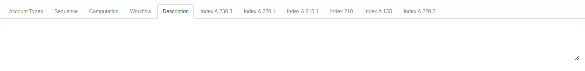

#### <a name="field-description">Description</a>

Deskripsi.

#### <a name="tab-index-a-230-3">TAB INDEX A.230.3</a>

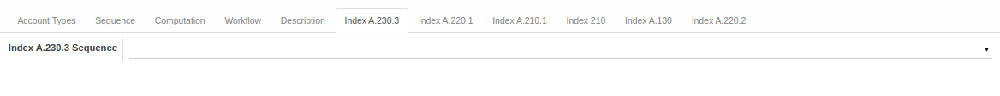

#### <a name="field-index-a-230-3-sequence">Index A.230.3 Sequence</a>

Urutan index A.230.3 yang digunakan.

#### <a name="tab-index-a-220-1">TAB INDEX A.220.1</a>

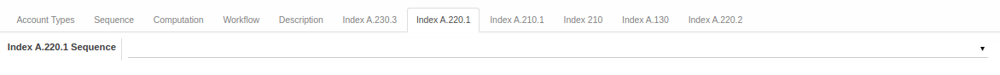

#### <a name="field-index-a-220-1-sequence">Index A.220.1 Sequence</a>

Urutan index A.220.1 yang digunakan.

#### <a name="tab-index-a-210-1">TAB INDEX A.210.1</a>

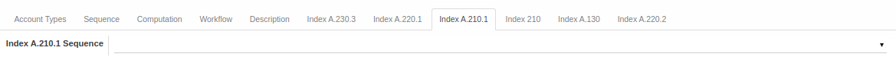

#### <a name="field-index-a-210-1-sequence">Index A.210.1 Sequence</a>

Urutan index A.210.1 yang digunakan.

#### <a name="tab-index-210">TAB INDEX 210</a>

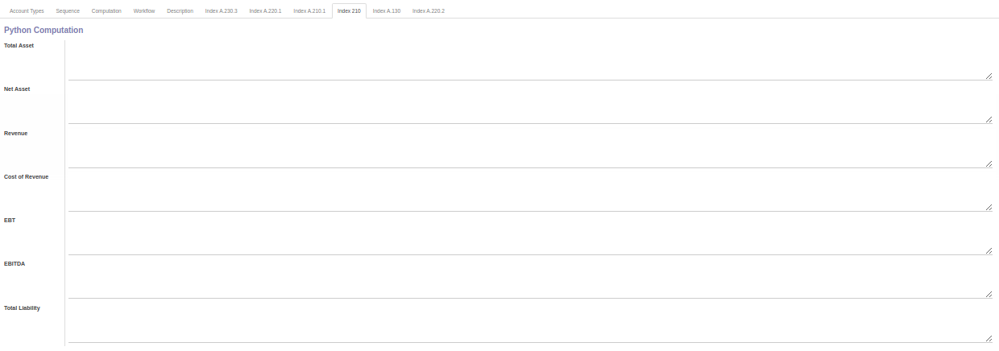

**KOMPUTASI PYTHON**

#### <a name="field-total-asset">Total Asset</a>

Kode python untuk melakukan komputasi total aset.

#### <a name="field-net-asset">Net Asset</a>

Kode python untuk melakukan komputasi aset bersih.

#### <a name="field-revenue">Revenue</a>

Kode python untuk melakukan komputasi pendapatan.

#### <a name="field-cost-of-revenue">Cost of Revenue</a>

Kode python untuk melakukan komputasi biaya pendapatan.

#### <a name="field-ebt">EBT</a>

Kode python untuk melakukan komputasi laba sebelum pajak.

#### <a name="field-ebitda">EBITDA</a>

Kode python untuk melakukan komputasi laba sebelum bunga, pajak, depresiasi, dan amortisasi.

#### <a name="field-total-liability">Total Liability</a>

Kode python untuk melakukan komputasi total kewajiban.

#### <a name="tab-index-a-130">TAB INDEX A.130</a>

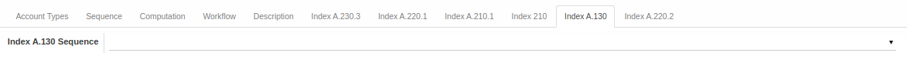

#### <a name="field-index-a-130-sequence">Index A.130 Sequence</a>

Urutan index A.130 yang digunakan.

#### <a name="tab-index-a-220-2">TAB INDEX A.220.2</a>

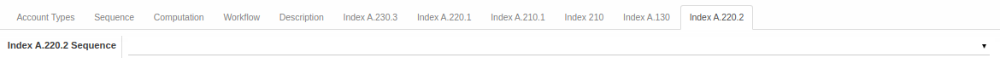

#### <a name="field-index-a-220-2-sequence">Index A.220.2 Sequence</a>

Urutan index A.220.2 yang digunakan.
