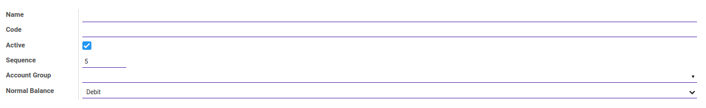
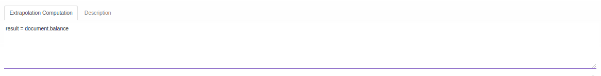
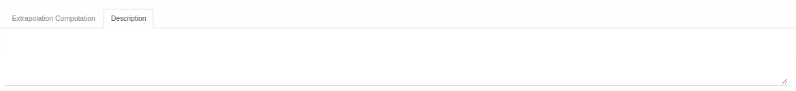

# Penjelasan Account Type

Informasi pada *Account Type* dibagi menjadi beberapa bagian, yaitu:

* [Header](#bagian-header)
* [Tab Extrapolation Computation](#tab-extrapolation-computation)
* [Tab Description](#tab-description)

### <a name="bagian-header">HEADER</a>

#### <a name="field-name">Name</a>

Nama tipe akun.

#### <a name="field-code">Code</a>

Kode tipe akun.

#### <a name="field-active">Active</a>

Penanda status tipe akun aktif.

#### <a name="field-sequence">Sequence</a>

Nomor urut.

#### <a name="field-account-group">Account Group</a>

Kelompok akun yang digunakan.

#### <a name="field-normal-balance">Normal Balance</a>

Saldo Normal yang digunakan.

#### <a name="tab-extrapolation-computation">TAB EXTRAPOLATION COMPUTATION</a>

#### <a name="field-extrapolation-computation">Extrapolation Computation</a>

Kode python untuk perhitungan ekstrapolasi.

#### <a name="tab-description">TAB DESCRIPTION</a>

#### <a name="field-description">Description</a>

Deskripsi.
