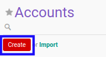

# Membuat Account

## A. INPUT

*(Tidak ada instruksi khusus)*

## B. LANGKAH KERJA

1. Buka menu **Accountant Service -> Configuration -> General Audit -> Trial Balance -> Accounts**. Abaikan jika sudah berada pada menu yang dimaksud.
2. Klik tombol **Create** pada bagian atas-kiri form.

3. Isi **[Name](./penjelasan.md#field-name)**. Wajib diisi.
4. Isi **[Code](./penjelasan.md#field-code)**. Wajib diisi.
5. Isi **[Sequence](./penjelasan.md#field-sequence)**. Wajib diisi.
6. Pilih **[Client](./penjelasan.md#field-client)**. Wajib diisi.
7. Pilih **[Type](./penjelasan.md#field-type)**. Wajib diisi.
8. Pilih **[Normal Balance](./penjelasan.md#field-normal-balance)**. Wajib diisi.
9. Beralih ke tab **[Description](./penjelasan.md#tab-description)**.
10. Isi **[Description](./penjelasan.md#field-description)**. Tidak wajib diisi.
11. Klik tombol **Save** pada bagian atas-kiri form.

## C. OUTPUT

*(Tidak ada instruksi khusus)*
