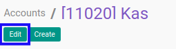

# Memodifikasi Account

## A. INPUT

* User yang akan memodifikasi harus memiliki akses untuk memodifikasi konfigurasi *Account*.

## B. LANGKAH KERJA

1. Buka menu **Accountant Service -> Configuration -> General Audit -> Trial Balance -> Accounts**. Abaikan jika sudah berada pada menu yang dimaksud.
2. Buka data *Account* yang akan dimodifikasi. Abaikan jika data sudah dibuka.
3. Klik tombol **Edit** pada bagian atas-kiri form.

4. Isi dan sesuaikan **[Name](./penjelasan.md#field-name)** jika dibutuhkan. Wajib diisi.
5. Isi dan sesuaikan **[Code](./penjelasan.md#field-code)** jika dibutuhkan. Wajib diisi.
6. Isi dan sesuaikan **[Sequence](./penjelasan.md#field-sequence)** jika dibutuhkan. Wajib diisi.
7. Pilih dan sesuaikan **[Client](./penjelasan.md#field-client)** jika dibutuhkan. Wajib diisi.
8. Pilih dan sesuaikan **[Type](./penjelasan.md#field-type)** jika dibutuhkan. Wajib diisi.
9. Pilih dan sesuaikan **[Normal Balance](./penjelasan.md#field-normal-balance)** jika dibutuhkan. Wajib diisi.
10. Beralih ke tab **[Description](./penjelasan.md#tab-description)**.
11. Isi dan sesuaikan **[Description](./penjelasan.md#field-description)** jika dibutuhkan. Tidak wajib diisi.
12. Klik tombol **Save** pada bagian atas-kiri form.

## C. OUTPUT

* Data *Account* akan berubah sesuai dengan perubahan yang dilakukan.
