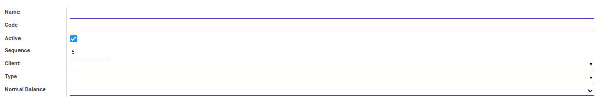
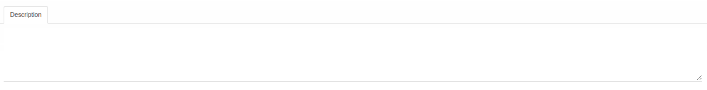

# Penjelasan Account

Informasi pada *Account* dibagi menjadi beberapa bagian, yaitu:

* [Header](#bagian-header)
* [Tab Description](#tab-description)

### <a name="bagian-header">HEADER</a>

#### <a name="field-name">Name</a>

Nama akun.

#### <a name="field-code">Code</a>

Kode akun.

#### <a name="field-active">Active</a>

Penanda status akun aktif.

#### <a name="field-sequence">Sequence</a>

Nomor urut.

#### <a name="field-client">Client</a>

Nama klien.

#### <a name="field-type">Type</a>

Tipe akun.

#### <a name="field-normal-balance">Normal Balance</a>

Saldo Normal yang digunakan.

#### <a name="tab-description">TAB DESCRIPTION</a>

#### <a name="field-description">Description</a>

Deskripsi.
