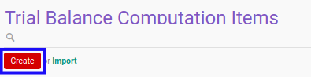

# Membuat Computation Item

## A. INPUT

*(Tidak ada instruksi khusus)*

## B. LANGKAH KERJA

1. Buka menu **Accountant Service -> Configuration -> General Audit -> Trial Balance -> Computation Items**. Abaikan jika sudah berada pada menu yang dimaksud.
2. Klik tombol **Create** pada bagian atas-kiri form.

3. Isi **[Name](./penjelasan.md#field-name)**. Wajib diisi.
4. Isi **[Code](./penjelasan.md#field-code)**. Wajib diisi.
5. Isi **[Sequence](./penjelasan.md#field-sequence)**. Wajib diisi.
6. Pilih **[Category](./penjelasan.md#field-category)**. Wajib diisi.
7. Aktifkan/ Deaktifkan **[Can Be Used for Mateliarity Analysis](./penjelasan.md#field-mateliarity-analysis)**. Tidak wajib diisi.
8. Beralih ke tab **[Default Python Code](./penjelasan.md#tab-default-python-code)**.
9. Isi **[Default Python Code](./penjelasan.md#field-default-python-code)**. Tidak wajib diisi.
10. Beralih ke tab **[Description](./penjelasan.md#tab-description)**.
11. Isi **[Description](./penjelasan.md#field-description)**. Tidak wajib diisi.
12. Klik tombol **Save** pada bagian atas-kiri form.

## C. OUTPUT

*(Tidak ada instruksi khusus)*
