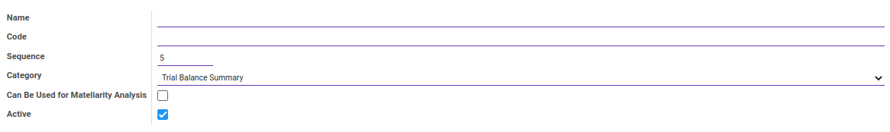
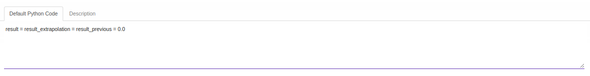
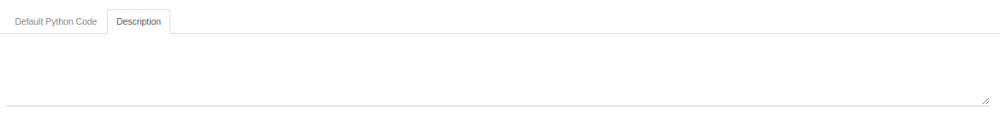

# Penjelasan Computation Item

Informasi pada *Computation Item* dibagi menjadi beberapa bagian, yaitu:

* [Header](#bagian-header)
* [Tab Default Python Code](#tab-default-python-code)
* [Tab Description](#tab-description)

### <a name="bagian-header">HEADER</a>

#### <a name="field-name">Name</a>

Nama item komputasi.

#### <a name="field-code">Code</a>

Kode item komputasi.

#### <a name="field-sequence">Sequence</a>

Nomor urut.

#### <a name="field-category">Category</a>

Kategori item komputasi.

#### <a name="field-mateliarity-analysis">Can Be Used for Mateliarity Analysis</a>

to do.

#### <a name="field-active">Active</a>

Penanda status item komputasi aktif.

#### <a name="tab-default-python-code">TAB DEFAULT PYTHON CODE</a>

#### <a name="field-default-python-code">Default Python Code</a>

Kode python untuk item komputasi.

#### <a name="tab-description">TAB DESCRIPTION</a>

#### <a name="field-description">Description</a>

Deskripsi.
