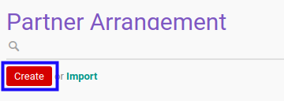

# Membuat Partner Arrangement

## A. INPUT

*(Tidak ada instruksi khusus)*

## B. LANGKAH KERJA

1. Buka menu **Accountant Report -> Configuration -> Partner Arrangement**. Abaikan jika sudah berada pada menu yang dimaksud.
2. Klik tombol **Create** pada bagian atas-kiri form.

3. Ubah **[# Partner Arrangement](./penjelasan.md#field-no-partner-arrangement)** dengan penomeran yang dikehendaki. Biarkan berisi **/** apabila menghendaki penomeran otomatis.
4. Pilih **[Managing Partner](./penjelasan.md#field-managing-partner)**. Wajib diisi.
5. Pilih **[Arrangement Date](./penjelasan.md#field-arrangement-date)**. Wajib diisi.
6. Beralih ke tab **[Partner](./penjelasan.md#tab-partner)**.
7. <a name="l7">[Tambah](./menambahkan-partner.md)/[Hapus](./menghapus-partner.md) **Partner**</a>. Ulangi langkah ini sampai **Partner** sesuai dengan keinginan.
8. Beralih ke tab **[Note](./penjelasan.md#tab-note)**.
9. Isi **[Note](./penjelasan.md#field-note)**. Tidak wajib diisi.
10. Beralih ke tab **[Policy](./penjelasan.md#tab-policy)**.
11. Aktifkan/ Deaktifkan **[Can Confirm](./penjelasan.md#field-can-confirm)**. Tidak wajib diisi.
12. Aktifkan/ Deaktifkan **[Can Validate](./penjelasan.md#field-can-validate)**. Tidak wajib diisi.
13. Aktifkan/ Deaktifkan **[Can Cancel](./penjelasan.md#field-can-cancel)**. Tidak wajib diisi.
14. Aktifkan/ Deaktifkan **[Can Restart](./penjelasan.md#field-can-restart)**. Tidak wajib diisi.
15. Klik tombol **Save** pada bagian atas-kiri form.

## C. OUTPUT

* Data *Partner Arrangement* akan terbuat.
