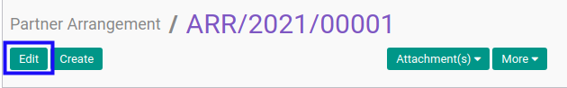
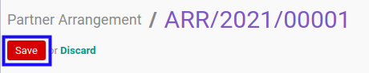

# Memodifikasi Partner Arrangement

## A. INPUT

* Data *Partner Arrangement* yang dapat dimodifikasi harus memiliki status **Draft**.

* User yang akan memodifikasi harus memiliki akses untuk memodifikasi *Partner Arrangement*.

## B. LANGKAH KERJA

1. Buka menu **Accountant Report -> Configuration -> Partner Arrangement**. Abaikan jika sudah berada pada menu yang dimaksud.
2. Buka data *Partner Arrangement* yang akan dimodifikasi. Abaikan jika data sudah dibuka.
3. Klik tombol **Edit** pada bagian atas-kiri form.

4. Ubah **[# Partner Arrangement](./penjelasan.md#field-no-partner-arrangement)** dengan penomeran yang dikehendaki. Biarkan berisi **/** apabila menghendaki penomeran otomatis.
5. Pilih dan sesuaikan **[Managing Partner](./penjelasan.md#field-managing-partner)** jika dibutuhkan. Wajib diisi.
6. Pilih dan sesuaikan **[Arrangement Date](./penjelasan.md#field-arrangement-date)** jika dibutuhkan. Wajib diisi.
7. Beralih ke tab **[Partner](./penjelasan.md#tab-partner)**.
8. <a name="l8">[Tambah](./menambahkan-partner.md)/[Hapus](./menghapus-partner.md) **Partner**</a>. Ulangi langkah ini sampai **Partner** sesuai dengan keinginan.
9. Beralih ke tab **[Note](./penjelasan.md#tab-note)**.
10. Isi dan sesuaikan **[Note](./penjelasan.md#field-note)** jika dibutuhkan. Tidak wajib diisi.
11. Beralih ke tab **[Policy](./penjelasan.md#tab-policy)**.
12. Aktifkan/ Deaktifkan **[Can Confirm](./penjelasan.md#field-can-confirm)** jika dibutuhkan. Tidak wajib diisi.
13. Aktifkan/ Deaktifkan **[Can Validate](./penjelasan.md#field-can-validate)** jika dibutuhkan. Tidak wajib diisi.
14. Aktifkan/ Deaktifkan **[Can Cancel](./penjelasan.md#field-can-cancel)** jika dibutuhkan. Tidak wajib diisi.
15. Aktifkan/ Deaktifkan **[Can Restart](./penjelasan.md#field-can-restart)** jika dibutuhkan. Tidak wajib diisi.
16. Klik tombol **Save** pada bagian atas-kiri form.

## C. OUTPUT

* Data *Partner Arrangement* akan berubah sesuai dengan perubahan yang dilakukan.
