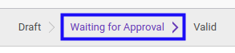
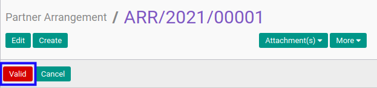
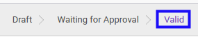

# Memvalidasi Partner Arrangement

## A. INPUT

* Data *Partner Arrangement* yang divalidasi harus memiliki status **Waiting for Approval**

* User yang akan memvalidasi harus memiliki akses untuk memvalidasi *Partner Arrangement*.

## B. LANGKAH KERJA

1. Buka menu **Accountant Report -> Configuration -> Partner Arrangement**. Abaikan jika sudah berada pada menu yang dimaksud.
2. Buka data *Partner Arrangement* yang akan divalidasi. Abaikan jika data sudah dibuka.
3. Klik tombol **Valid** pada bagian atas-kiri form.

## C. OUTPUT

* Status *Partner Arrangement* akan berubah menjadi **Valid**.

