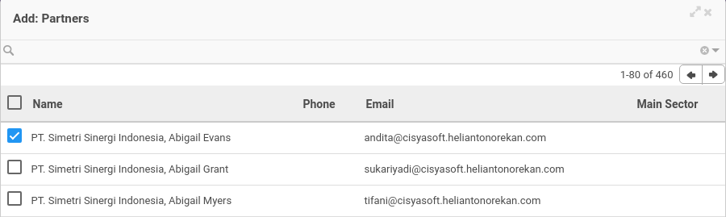

# Menambahkan Partner

*(Instruksi kerja ini merupakan sub instruksi dari (1) [Membuat Partner Arrangement](./membuat.md), atau (2) [Memodifikasi Partner Arrangement](./memodifikasi.md). Instruksi kerja ini tidak bisa berdiri sendiri)*

## A. INPUT

*(Tidak ada instruksi khusus)*

## B. LANGKAH KERJA

1. Klik label **Add an Item** pada bagian atas-kiri tabel ***Partner***

Pop-up ***Partner*** akan muncul.

2. Seleksi data *Partner*.
3. Klik tombol **Select** pada bagian bawah-kiri pop-up ***Partner***

4. Lanjutkan [langkah ke-7 instruksi kerja Membuat Partner Arrangement](./membuat.md#l7) atau [langkah ke-8 instruksi kerja Memodifikasi Partner Arrangement](./memodifikasi.md#l8).

## C. OUTPUT

*(Tidak ada instruksi khusus)*
