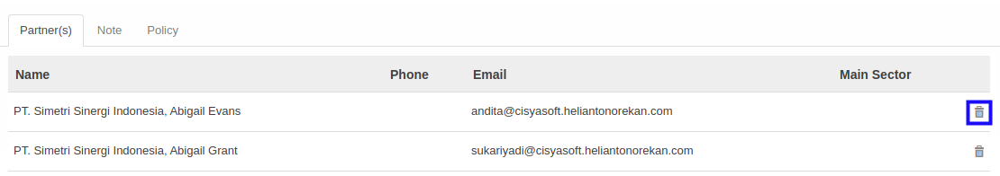
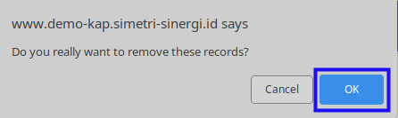

# Menghapus Partner

*(Instruksi kerja ini merupakan sub instruksi dari (1) [Membuat Partner Arrangement](./membuat.md), atau (2) [Memodifikasi Partner Arrangement](./memodifikasi.md). Instruksi kerja ini tidak bisa berdiri sendiri)*

## A. INPUT

*(Tidak ada instruksi khusus)*

## B. LANGKAH KERJA

1. Klik icon tempat sampah pada bagian kanan **Partner** yang akan dihapus.

2. Klik tombol **Ok** pada *pop-up* konfirmasi penghapusan yang muncul.

3. Ulangi langkah ke-1 untuk setiap **Partner** yang akan dihapus.
4. Lanjutkan [langkah ke-7 instruksi kerja Membuat Partner Arrangement](./membuat.md#l7) atau [langkah ke-8 instruksi kerja Memodifikasi Partner Arrangement](./memodifikasi.md#l8).

## C. OUTPUT

*(Tidak ada instruksi khusus)*
