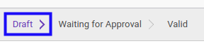
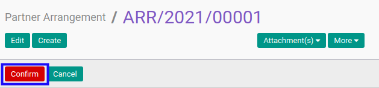

# Mengkonfirmasi Partner Arrangement

## A. INPUT

* Data *Partner Arrangement* yang dapat dikonfirmasi harus memiliki status **Draft**.

* User yang akan mengkonfirmasi harus memiliki akses untuk mengkonfirmasi *Partner Arrangement*.

## B. LANGKAH KERJA

1. Buka menu **Accountant Report -> Configuration -> Partner Arrangement**. Abaikan jika sudah berada pada menu yang dimaksud.
2. Buka data *Partner Arrangement* yang akan dikonfirmasi. Abaikan jika data sudah dibuka.
3. Klik tombol **Confirm** pada bagian atas-kiri form.

## C. OUTPUT

* Status dari *Partner Arrangement* akan berubah menjadi **Waiting for Approval**.

* Isian *Partner Arrangement* sudah tidak bisa diubah.
