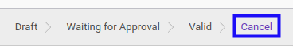

# Merestart Partner Arrangement

## A. INPUT

* Data *Partner Arrangement* yang akan direstart harus memiliki status **Cancel**.

* User yang akan merestart harus memiliki akses untuk merestart *Partner Arrangement*.

## B. LANGKAH KERJA

1. Buka menu **Accountant Report -> Configuration -> Partner Arrangement**. Abaikan jika sudah berada pada menu yang dimaksud.
2. Buka data *Partner Arrangement* yang akan direstart. Abaikan jika data sudah dibuka.
3. Klik tombol **Restart** pada bagian atas-kiri form.

## C. OUTPUT

* Status dari *Partner Arrangement* akan berubah menjadi **Draft**.

* *Partner Arrangement* dapat kembali dimodifikasi.
