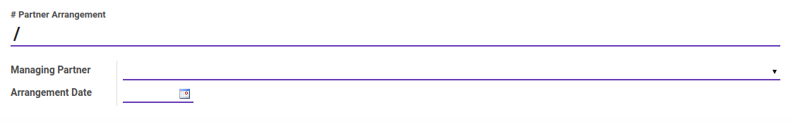
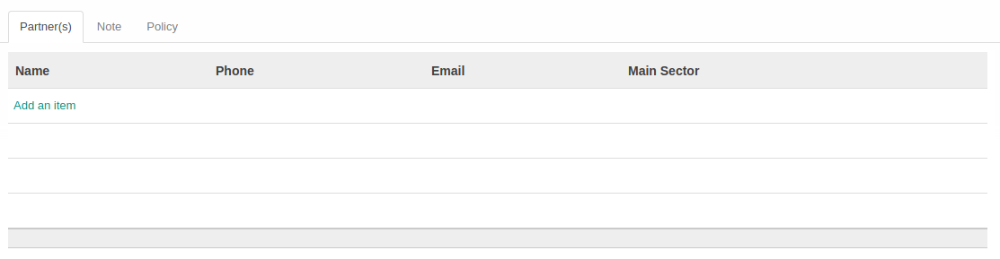
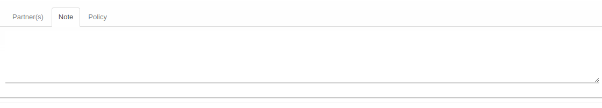
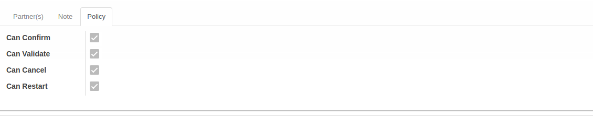

# Penjelasan Partner Arrangement

Informasi pada *Partner Arrangement* dibagi menjadi beberapa bagian, yaitu:

* [Header](#bagian-header)
* [Tab Partner](#tab-partner)
* [Tab Note](#tab-note)
* [Tab Policy](#tab-policy)

### <a name="bagian-header">HEADER</a>

#### <a name="field-no-partner-arrangement"># Partner Arrangement</a>

Nomor dokumen.

#### <a name="field-managing-partner">Managing Partner</a>

Nama managing partner.

#### <a name="field-arrangement-date">Arrangement Date</a>

Tanggal arrangement.

#### <a name="tab-partner">TAB PARTNER(S)</a>

Nama-nama partner pada KAP/KJA

#### <a name="tab-note">TAB NOTE</a>

#### <a name="field-note">Note</a>

Catatan.

#### <a name="tab-policy">TAB POLICY</a>

#### <a name="field-can-confirm">Can Confirm</a>

Berhak/tidaknya user untuk dapat mengkonfirmasi partner arrangement.

#### <a name="field-can-validate">Can Validate</a>

Berhak/tidaknya user untuk dapat memvalidasi partner arrangement.

#### <a name="field-can-cancel">Can Cancel</a>

Berhak/tidaknya user untuk dapat membatalkan partner arrangement.

#### <a name="field-can-restart">Can Restart</a>

Berhak/tidaknya user untuk dapat merestart partner arrangement.
