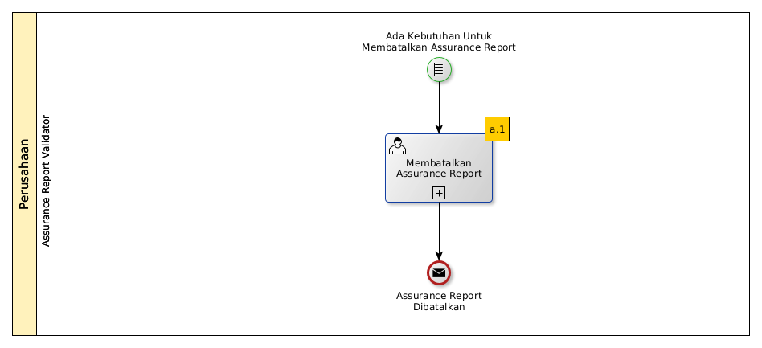

# Membatalkan Assurance Report

## A. START

* Condition: Ada kebutuhan untuk membatalkan Assurance Report.

## B. ROLE YANG TERLIBAT

* Assurance Report Validator

## C. INTRUKSI KERJA

### C.1. Membatalkan Assurance Report

#### C.1.1 Instruksi Kerja Utama

[Odoo - Assurance Report: 2.1.10](../transaksi/assurance-report/membatalkan.md)

## D. END

*Message:* Assurance Report dibatalkan.
