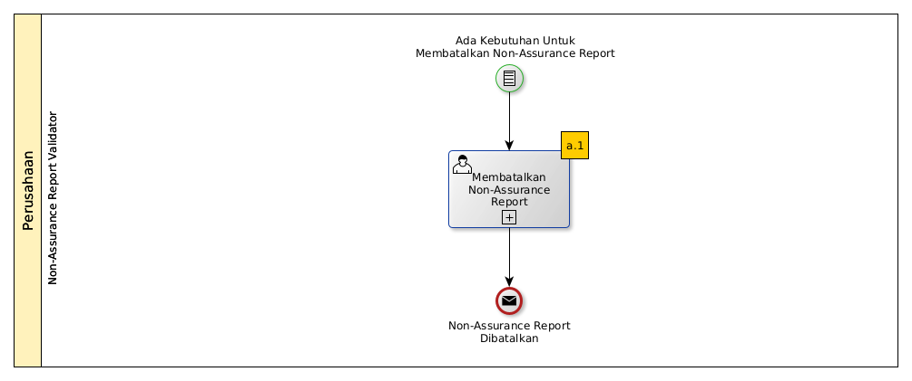

# Membatalkan Non-Assurance Report

## A. START

* Condition: Ada kebutuhan untuk membatalkan Non-Assurance Report.

## B. ROLE YANG TERLIBAT

* Non-Assurance Report Validator

## C. INTRUKSI KERJA

### C.1. Membatalkan Non-Assurance Report

#### C.1.1 Instruksi Kerja Utama

[Odoo - Non-Assurance Report: 2.1.10](../transaksi/non-assurance-report/membatalkan.md)

## D. END

*Message:* Non-Assurance Report dibatalkan.
