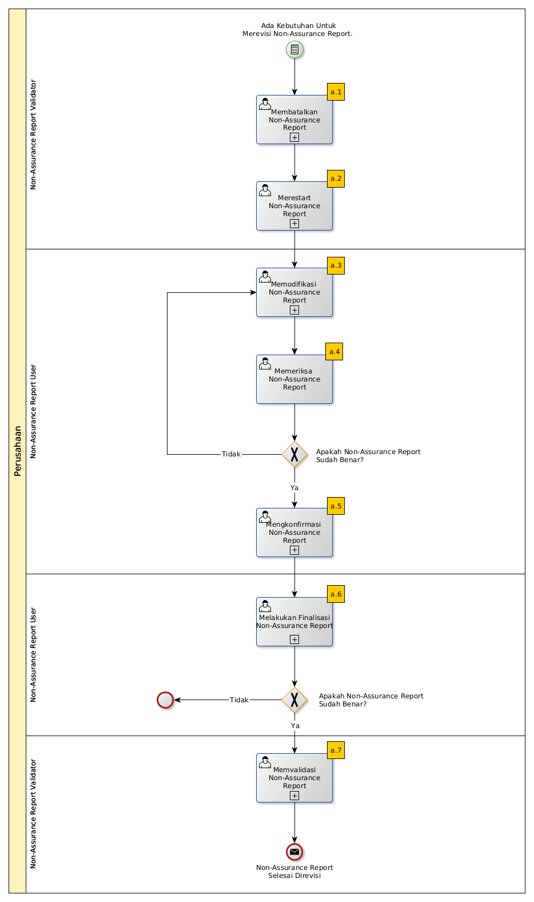

# Merevisi Non-Assurance Report

## A. START

* Condition: Ada kebutuhan untuk merevisi Non-Assurance Report.

## B. ROLE YANG TERLIBAT

* Non-Assurance Report User
* Non-Assurance Report Validator

## C. INTRUKSI KERJA

### C.1. Membatalkan Non-Assurance Report

#### C.1.1 Instruksi Kerja Utama

[Odoo - Non-Assurance Report: 2.2.10](../transaksi/non-assurance-report/membatalkan.md)

### C.2. Merestart Non-Assurance Report

#### C.2.1 Instruksi Kerja Utama

[Odoo - Non-Assurance Report: 2.2.11](../transaksi/non-assurance-report/merestart.md)

### C.3. Memodifikasi Non-Assurance Report

#### C.3.1 Instruksi Kerja Utama

[Odoo - Non-Assurance Report: 2.2.3](../transaksi/non-assurance-report/memodifikasi.md)

### C.4. Mengkonfirmasi Non-Assurance Report

#### C.4.1 Instruksi Kerja Utama

[Odoo - Non-Assurance Report: 2.2.5](../transaksi/non-assurance-report/mengkonfirmasi.md)

### C.5. Melakukan Finalisasi Non-Assurance Report

#### C.5.1 Instruksi Kerja Utama

[Odoo - Non-Assurance Report: 2.2.6](../transaksi/non-assurance-report/melakukan-finalisasi.md)

#### C.5.2 Sub Instruksi Kerja

* [Odoo - Non-Assurance Report: 2.2.8](../transaksi/non-assurance-report/memilih-jawaban-qualitative.md)
* [Odoo - Non-Assurance Report: 2.2.9](../transaksi/non-assurance-report/mengisi-jawaban-quantitative.md)

### C.6. Memvalidasi Non-Assurance Report

#### C.6.1 Instruksi Kerja Utama

[Odoo - Non-Assurance Report: 2.2.7](../transaksi/non-assurance-report/memvalidasi.md)

## D. END

*Message:* Non-Assurance Report selesai diproses.
