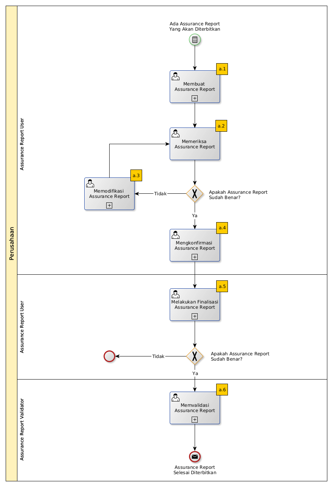

# Merilis Assurance Report

## A. START

* Condition: Ada kebutuhan untuk merilis Assurance Report.

## B. ROLE YANG TERLIBAT

* Assurance Report User
* Assurance Report Validator

## C. INTRUKSI KERJA

### C.1. Membuat Assurance Report

#### C.1.1 Instruksi Kerja Utama

[Odoo - Assurance Report: 2.1.2](../transaksi/assurance-report/membuat.md)

### C.2. Mengkonfirmasi Assurance Report

#### C.2.1 Instruksi Kerja Utama

[Odoo - Assurance Report: 2.1.5](../transaksi/assurance-report/mengkonfirmasi.md)

### C.3. Melakukan Finalisasi Assurance Report

#### C.3.1 Instruksi Kerja Utama

[Odoo - Assurance Report: 2.1.6](../transaksi/assurance-report/melakukan-finalisasi.md)

#### C.3.2 Sub Instruksi Kerja

* [Odoo - Assurance Report: 2.1.8](../transaksi/assurance-report/memilih-jawaban-qualitative.md)
* [Odoo - Assurance Report: 2.1.9](../transaksi/assurance-report/mengisi-jawaban-quantitative.md)

### C.4. Memvalidasi Assurance Report

#### C.4.1 Instruksi Kerja Utama

[Odoo - Assurance Report: 2.1.7](../transaksi/assurance-report/memvalidasi.md)

## D. END

*Message:* Assurance Report selesai diproses.
