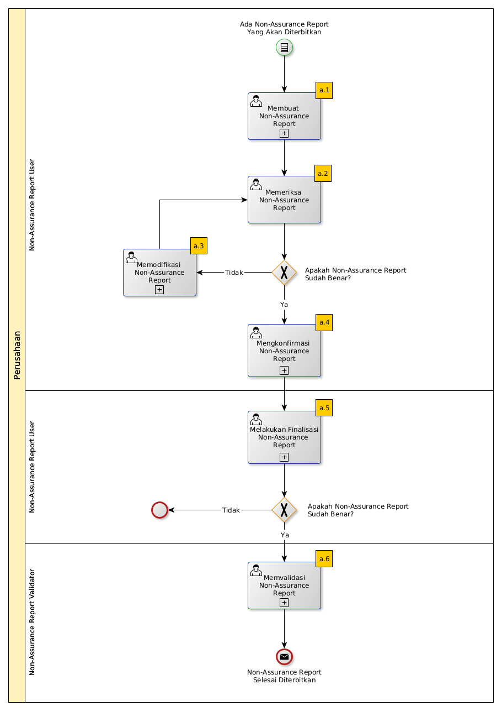

# Merilis Non-Assurance Report

## A. START

* Condition: Ada Non-Assurance Report Yang Akan Diterbitkan.

## B. ROLE YANG TERLIBAT

* Non-Assurance Report User
* Non-Assurance Report Validator

## C. INTRUKSI KERJA

### C.1. Membuat Non-Assurance Report

#### C.1.1 Instruksi Kerja Utama

[Odoo - Non-Assurance Report: 2.2.2](../transaksi/non-assurance-report/membuat.md)

### C.2. Mengkonfirmasi Non-Assurance Report

#### C.2.1 Instruksi Kerja Utama

[Odoo - Non-Assurance Report: 2.2.5](../transaksi/non-assurance-report/mengkonfirmasi.md)

### C.3. Melakukan Finalisasi Non-Assurance Report

#### C.3.1 Instruksi Kerja Utama

[Odoo - Non-Assurance Report: 2.2.6](../transaksi/non-assurance-report/melakukan-finalisasi.md)

#### C.3.2 Sub Instruksi Kerja

* [Odoo - Non-Assurance Report: 2.2.8](../transaksi/non-assurance-report/memilih-jawaban-qualitative.md)
* [Odoo - Non-Assurance Report: 2.2.9](../transaksi/non-assurance-report/mengisi-jawaban-quantitative.md)

### C.4. Memvalidasi Non-Assurance Report

#### C.4.1 Instruksi Kerja Utama

[Odoo - Non-Assurance Report: 2.2.7](../transaksi/non-assurance-report/memvalidasi.md)

## D. END

*Message:* Non-Assurance Report selesai diterbitkan.
