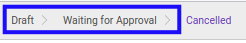
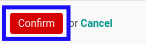

# Membatalkan Adjustment Entry

## A. INPUT

* Data *Adjustment Entry* yang akan dibatalkan harus memiliki status selain **Cancelled**.

* User yang akan membatalkan harus memiliki akses untuk membatalkan *Adjustment Entry*.

## B. LANGKAH KERJA

1. Buka menu **Accountant Service -> General Audit -> Adjustment Entries**. Abaikan jika sudah berada pada menu yang dimaksud.
2. Buka data *Adjustment Entry* yang akan dibatalkan. Abaikan jika data sudah dibuka.
3. Klik tombol **Cancel** pada bagian atas-kiri form.

4. Klik tombol **Ok** pada *pop-up* konfirmasi pembatalan yang muncul.

5. Pilih **Reason** pada *pop-up* **Cancellation Reason** yang muncul.

6. Klik tombol **Confirm** pada *pop-up* Cancellation Reason.

7. Klik tombol **Ok** pada *pop-up* konfirmasi pembatalan yang muncul.

## C. OUTPUT

* Status dari *Adjustment Entry* akan berubah menjadi **Cancelled**

