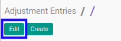
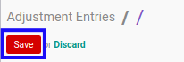

# Memodifikasi Adjustment Entry

## A. INPUT

* Data *Adjustment Entry* yang dapat dimodifikasi harus memiliki status **Draft**.

* User yang akan memodifikasi harus memiliki akses untuk memodifikasi *Adjustment Entry*.

## B. LANGKAH KERJA

1. Buka menu **Accountant Service -> General Audit -> Adjustment Entries**. Abaikan jika sudah berada pada menu yang dimaksud.
2. Buka data *Adjustment Entry* yang akan dimodifikasi. Abaikan jika data sudah dibuka.
3. Klik tombol **Edit** pada bagian atas-kiri form.

4. Ubah **[# Document](./penjelasan.md#field-no-document)** dengan penomeran yang dikehendaki. Biarkan berisi **/** apabila menghendaki penomeran otomatis.
5. Pilih dan sesuaikan **[# General Audit](./penjelasan.md#field-no-general-audit)** jika dibutuhkan. Wajib diisi.
6. Pilih dan sesuaikan **[Adjustment Type](./penjelasan.md#field-adjustment-type)** jika dibutuhkan. Wajib diisi.
7. Beralih ke tab **[Details](./penjelasan.md#tab-details)**.
8. <a name="l8">[Tambah](./menambahkan-detail.md)/[Modifikasi](./memodifikasi-detail.md)/[Hapus](./menghapus-detail.md) **Details**</a>. Ulangi langkah ini sampai **Details** sesuai dengan keinginan.
9. Klik tombol **Save** pada bagian atas-kiri form.

## C. OUTPUT

* Data *Adjustment Entry* akan berubah sesuai dengan perubahan yang dilakukan.
