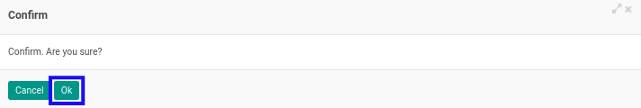

# Mengkonfirmasi Adjustment Entry

* Data *Adjustment Entry* yang dapat dikonfirmasi harus memiliki status **Draft**.

* User yang akan mengkonfirmasi harus memiliki akses untuk mengkonfirmasi *Adjustment Entry*.

## B. LANGKAH KERJA

1. Buka menu **Accountant Service -> General Audit -> Adjustment Entries**. Abaikan jika sudah berada pada menu yang dimaksud.
2. Buka data *Adjustment Entry* yang akan dikonfirmasi. Abaikan jika data sudah dibuka.
3. Klik tombol **Confirm** pada bagian atas-kiri form.

4. Klik tombol **Ok** pada *pop-up* konfirmasi **Confirm** yang muncul.

## C. OUTPUT

* Status dari *Adjustment Entry* akan berubah menjadi **Waiting for Approval**.

* Isian *Adjustment Entry* sudah tidak bisa diubah.
