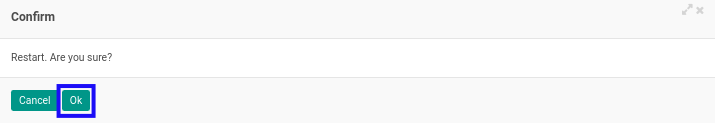

# Merestart Adjustment Entry

## A. INPUT

* Data *Adjustment Entry* yang akan direstart harus memiliki status **Cancelled**.

* User yang akan merestart harus memiliki akses untuk merestart *Adjustment Entry*.

## B. LANGKAH KERJA

1. Buka menu **Accountant Service -> General Audit -> Adjustment Entries**. Abaikan jika sudah berada pada menu yang dimaksud.
2. Buka data *Adjustment Entry* yang akan direstart. Abaikan jika data sudah dibuka.
3. Klik tombol **Restart** pada bagian atas-kiri form.

4. Klik tombol **Ok** pada *pop-up* konfirmasi **Restart** yang muncul.

## C. OUTPUT

* Status dari *Adjustment Entry* akan berubah menjadi **Draft**.

* *Adjustment Entry* dapat kembali dimodifikasi.
