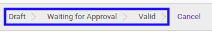
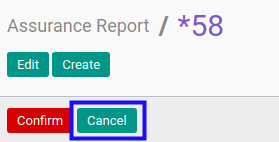
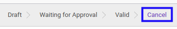

# Membatalkan Assurance Report

## A. INPUT

* Data *Assurance Report* yang akan dibatalkan harus memiliki status selain **Cancel**.

* User yang akan membatalkan harus memiliki akses untuk membatalkan *Assurance Report*

## B. LANGKAH KERJA

1. Buka menu **Accountant Report -> Accountant Report -> Assurance**. Abaikan jika sudah berada pada menu yang dimaksud.
2. Buka data *Assurance Report* yang akan dibatalkan. Abaikan jika data sudah dibuka.
3. Klik tombol **Cancel** pada bagian atas-kiri form.

## C. OUTPUT

* Status dari *Assurance Report* akan berubah menjadi **Cancel**

