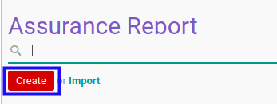
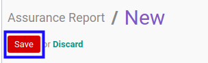

# Membuat Assurance Report

## A. INPUT

*(Tidak ada instruksi khusus)*

## B. LANGKAH KERJA

1. Buka menu **Accountant Report -> Accountant Report -> Assurance**. Abaikan jika sudah berada pada menu yang dimaksud.
2. Klik tombol **Create** pada bagian atas-kiri form.

3. Ubah **[# Report](./penjelasan.md#field-no-report)** dengan penomeran yang dikehendaki. Biarkan berisi **/** apabila menghendaki penomeran otomatis.
4. Pilih **[Operating Unit](./penjelasan.md#field-operating-unit)**. Tidak wajib diisi.
5. Pilih **[Operating Unit Partner](./penjelasan.md#field-operating-unit-partner)**. Tidak wajib diisi.
6. Pilih **[Customer](./penjelasan.md#field-customer)**. Wajib diisi.
7. Pilih **[Project](./penjelasan.md#field-project)**. Tidak wajib diisi.
8. Pilih **[Date Start](./penjelasan.md#field-date-start)**. Wajib diisi.
9. Pilih **[Date End](./penjelasan.md#field-date-end)**. Wajib diisi.
10. Pilih **[Accountant Service](./penjelasan.md#field-accountant-service)**. Wajib diisi.
11. Isi **[Subsequent Job Num](./penjelasan.md#field-subsequent-job)**. Tidak wajib diisi.
12. Pilih **[Restatement Report](./penjelasan.md#field-restatement-report)**. Tidak wajib diisi.
13. Aktifkan/ Deaktifkan **[Method Required](./penjelasan.md#field-method-required)**. Tidak wajib diisi.
14. Pilih **[Method](./penjelasan.md#field-method)**. Tidak wajib diisi.
15. Pilih **[Date](./penjelasan.md#field-date)**. Wajib diisi.
16. Pilih **[Signing Accountant](./penjelasan.md#field-signing-accountant)**. Wajib diisi.
17. Aktifkan/ Deaktifkan **[Opinion Required](./penjelasan.md#field-opinion-required)**. Tidak wajib diisi.
18. Pilih **[Opinion](./penjelasan.md#field-opinion)**. Tidak wajib diisi.
19. Pilih **[Main Report Attachment](./penjelasan.md#field-main-report-attachment)**. Tidak wajib diisi.
20. Beralih ke tab **[Client Informations](./penjelasan.md#tab-client-informations)**.
21. Pilih **[Information Based On](./penjelasan.md#field-information-based-on)**. Tidak wajib diisi.
22. Pilih **[Client Currency](./penjelasan.md#field-client-currency)**. Tidak wajib diisi.
23. Isi **[Revenue](./penjelasan.md#field-revenue)**. Tidak wajib diisi.
24. Isi **[Total Asset](./penjelasan.md#field-total-asset)**. Tidak wajib diisi.
25. Isi **[Total Liability](./penjelasan.md#field-total-liability)**. Tidak wajib diisi.
26. Isi **[EBIT](./penjelasan.md#field-ebit)**. Tidak wajib diisi.
27. Isi **[Tax Expense](./penjelasan.md#field-tax-expense)**. Tidak wajib diisi.
28. Isi **[Total Net Profit](./penjelasan.md#field-total-net-profit)**. Tidak wajib diisi.
29. Isi **[Total Net Profit & OCI](./penjelasan.md#field-total-net-profit-oci)**. Tidak wajib diisi.
30. Beralih ke tab **[Note](./penjelasan.md#tab-note)**.
31. Isi **[Note](./penjelasan.md#field-note)**. Tidak wajib diisi.
32. Beralih ke tab **[Policy](./penjelasan.md#tab-policy)**.
33. Aktifkan/ Deaktifkan **[Can Confirm](./penjelasan.md#field-can-confirm)**. Tidak wajib diisi.
34. Aktifkan/ Deaktifkan **[Can Validate](./penjelasan.md#field-can-validate)**. Tidak wajib diisi.
35. Aktifkan/ Deaktifkan **[Can Cancel](./penjelasan.md#field-can-cancel)**. Tidak wajib diisi.
36. Aktifkan/ Deaktifkan **[Can Restart](./penjelasan.md#field-can-restart)**. Tidak wajib diisi.
37. Klik tombol **Save** pada bagian atas-kiri form.

## C. OUTPUT

* Data *Assurance Report* akan terbuat.
