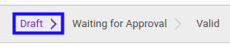
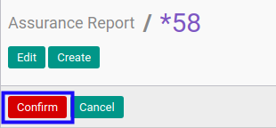

# Mengkonfirmasi Assurance Report

## A. INPUT

* Data *Assurance Report* yang dapat dikonfirmasi harus memiliki status **Draft**.

* User yang akan mengkonfirmasi harus memiliki akses untuk mengkonfirmasi *Assurance Report*.

## B. LANGKAH KERJA

1. Buka menu **Accountant Report -> Accountant Report -> Assurance**. Abaikan jika sudah berada pada menu yang dimaksud.
2. Buka data *Assurance Report* yang akan dikonfirmasi. Abaikan jika data sudah dibuka.
3. Klik tombol **Confirm** pada bagian atas-kiri form.

## C. OUTPUT

* Status dari *Assurance Report* akan berubah menjadi **Waiting for Approval**.

* Isian *Assurance Report* sudah tidak bisa diubah.
