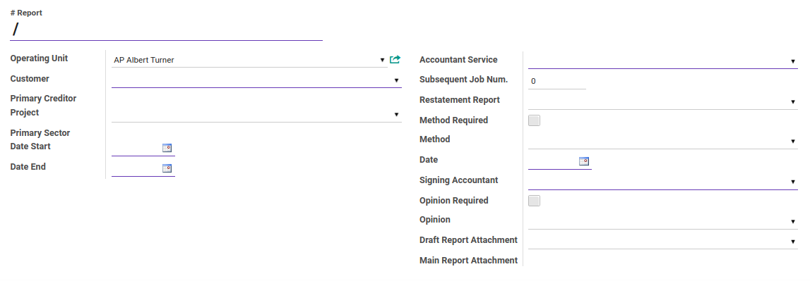
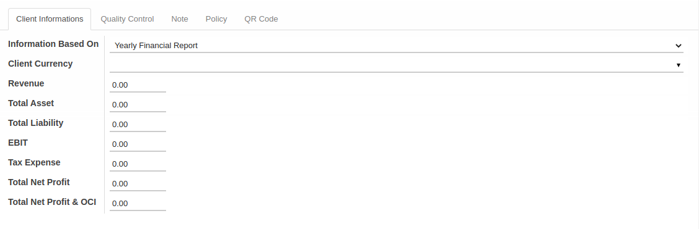
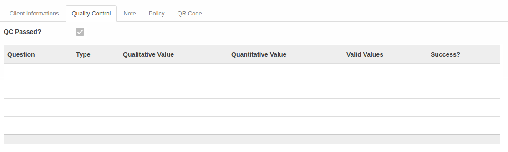
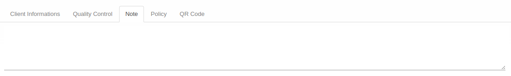
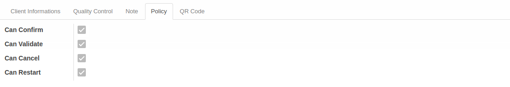
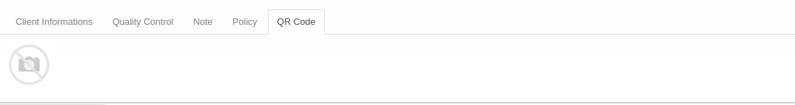

# Penjelasan Assurance Report

Informasi pada *Assurance Report* dibagi menjadi beberapa bagian, yaitu:

* [Header](#bagian-header)
* [Tab Client Informations](#tab-client-informations)
* [Tab Quality Control](#tab-quality-control)
* [Tab Note](#tab-note)
* [Tab Policy](#tab-policy)
* [Tab QR Code](#tab-qr-code)

### <a name="bagian-header">HEADER</a>

#### <a name="field-no-report"># Report</a>

Nomor laporan.

#### <a name="field-operating-unit">Operating Unit</a>

Nama operating unit.

#### <a name="field-operating-unit-partner">Operating Unit Partner</a>

Nama perusahaan operating unit yang digunakan.

#### <a name="field-customer">Customer</a>

Nama customer.

#### <a name="field-primary-sector">Primary Sector</a>

Nama sektor utama proyek.

#### <a name="field-project">Project</a>

Nama proyek.

#### <a name="field-primary-creditor">Primary Creditor</a>

Nama kreditur utama.

#### <a name="field-date-start">Date Start</a>

Tanggal mulai.

#### <a name="field-date-end">Date End</a>

Tanggal selesai.

#### <a name="field-accountant-service">Accountant Service</a>

Jenis accountant service.

#### <a name="field-subsequent-job">Subsequent Job Num.</a>

Nomor urut pekerjaan.

#### <a name="field-retatement-report">Restatement Report</a>

Restatement report.

#### <a name="field-method-required">Method Required</a>

Penanda status dibutuhkan metode aktif.

#### <a name="field-method">Method</a>

Nama metode.

#### <a name="field-date">Date</a>

Tanggal report.

#### <a name="field-signing-accountant">Signing Accountant</a>

Nama akuntan yang ditugaskan.

#### <a name="field-opinion-required">Opinion Required</a>

Penanda status dibutuhkan opini aktif.

#### <a name="field-main-report-attachment">Main Report Attachment</a>

Lampiran laporan utama.

#### <a name="tab-client-informations">TAB CLIENT INFORMATIONS</a>

#### <a name="field-information-based-on">Information Based On</a>

Dasar referensi laporan.

#### <a name="field-client-currency">Client Currency</a>

Mata uang yang digunakan klien.

#### <a name="field-revenue">Revenue</a>

Jumlah pendapatan.

#### <a name="field-total-asset">Total Asset</a>

Jumlah total asset.

#### <a name="field-total-liability">Total Liability</a>

Jumlah total liabilitas.

#### <a name="field-ebit">EBIT</a>

Nilai EBIT.

#### <a name="field-tax-expense">Tax Expense</a>

Jumlah pengeluaran pajak.

#### <a name="field-total-net-profit">Total Net Profit</a>

Jumlah total keuntungan bersih.

#### <a name="field-total-net-profit-oci">Total Net Profit dan OCI</a>

Jumlah total keuntungan bersih dan OCI.

#### <a name="tab-quality-control">TAB QUALITY CONTROL</a>

#### <a name="field-question">Question</a>

Item pertanyaan untuk kontrol kualitas.

#### <a name="field-question-type">Type</a>

Tipe jawaban untuk kontrol kualitas (kualitatif atau kuantitatif).

#### <a name="field-qualitative-value">Qualitative Value</a>

User diharuskan untuk memilih satu dari beberapa pilihan.

#### <a name="field-quantitative-value">Quantitative Value</a>

User diharuskan untuk menginput jawaban berupa angka.

#### <a name="field-valid-values">Valid Values</a>

Nilai jawaban yang valid.

#### <a name="field-success">Success?</a>

Hasil quality control sukses atau tidak (Isian jawaban dibandingkan dengan Valid Values)

#### <a name="tab-note">TAB NOTE</a>

#### <a name="field-note">Note</a>

Catatan.

#### <a name="tab-policy">TAB POLICY</a>

#### <a name="field-can-confirm">Can Confirm</a>

Berhak/tidaknya user aktif untuk dapat mengkonfirmasi assurance report.

#### <a name="field-can-validate">Can Validate</a>

Berhak/tidaknya user aktif untuk dapat memvalidasi assurance report.

#### <a name="field-can-cancel">Can Cancel</a>

Berhak/tidaknya user aktif untuk dapat membatalkan assurance report.

#### <a name="field-can-restart">Can Restart</a>

Berhak/tidaknya user aktif untuk dapat merestart assurance report.

#### <a name="tab-qr-code">TAB QR CODE</a>

#### <a name="field-qr-code">QR Code</a>

Fasilitas untuk memindai QR Code.
