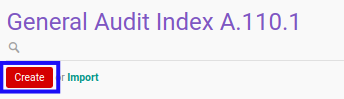

# Membuat Index A.110.1

## A. INPUT

*(Tidak ada instruksi khusus)*

## B. LANGKAH KERJA

1. Buka menu **Accountant Service -> General Audit -> Risk Assessment-> Index A.110.1**. Abaikan jika sudah berada pada menu yang dimaksud.
2. Klik tombol **Create** pada bagian atas-kiri form.

3. Ubah **[# Document](./penjelasan.md#field-no-document)** dengan penomeran yang dikehendaki. Biarkan berisi **/** apabila menghendaki penomeran otomatis.
4. Pilih **[# General Audit](./penjelasan.md#field-no-general-audit)**. Wajib diisi.
5. Pilih **[Responsible](./penjelasan.md#field-responsible)**. Wajib diisi.
6. Beralih ke tab **[Question](./penjelasan.md#tab-question)**.
7. Pilih **[Apakah terdapat isu mengenai kelangsungan usaha yang tersaji pada catatan atas laporan keuangan sebelumnya?](./penjelasan.md#field-question-1)**. Tidak wajib diisi.
8. Pilih **[Apakah terdapat isu mengenai kelangsungan usaha yang tersaji pada opini auditor sebelumnya?](./penjelasan.md#field-question-2)**. Tidak wajib diisi.
9. Pilih **[Apakah terdapat isu mengenai restrukturisasi keuangan?](./penjelasan.md#field-question-3)**. Tidak wajib diisi.
10. Pilih **[Apakah terdapat isu mengenai kerugian yang berkelanjutan?](./penjelasan.md#field-question-4)**. Tidak wajib diisi.
11. Pilih **[Apakah terdapat isu mengenai penyajian kembali (restated) atas laporan keuangan?](./penjelasan.md#field-question-5)**. Tidak wajib diisi.
12. Pilih **[Apakah opini auditor periode lalu (jika ada) menyatakan opini selain wajar tanpa pengecualian?](./penjelasan.md#field-question-6)**. Tidak wajib diisi.
13. Pilih **[Conclusion](./penjelasan.md#field-conclusion)**. Tidak wajib diisi.
14. Isi **[Conclusion Additional Explanation](./penjelasan.md#field-conclusion-add-explanation)**. Tidak wajib diisi.
15. Klik tombol **Save** pada bagian atas-kiri form.

## C. OUTPUT

* Data *Index A.110.1* akan terbuat dengan status **Draft**

