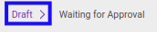
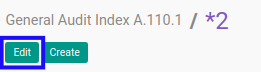
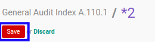

# Memodifikasi Index A.110.1

## A. INPUT

* Data *Index A.110.1* yang dapat dimodifikasi harus memiliki status **Draft**.

* User yang akan memodifikasi harus memiliki akses untuk memodifikasi *Index A.110.1*.

## B. LANGKAH KERJA

1. Buka menu **Accountant Service -> General Audit -> Risk Assessment-> Index A.110.1**. Abaikan jika sudah berada pada menu yang dimaksud.
2. Buka data *Index A.110.1* yang akan dimodifikasi. Abaikan jika data sudah dibuka.
3. Klik tombol **Edit** pada bagian atas-kiri form.

4. Ubah **[# Document](./penjelasan.md#field-no-document)** dengan penomeran yang dikehendaki. Biarkan berisi **/** apabila menghendaki penomeran otomatis.
5. Pilih dan sesuaikan **[# General Audit](./penjelasan.md#field-no-general-audit)** jika dibutuhkan. Wajib diisi.
6. Pilih dan sesuaikan **[Responsible](./penjelasan.md#field-responsible)** jika dibutuhkan. Wajib diisi.
7. Beralih ke tab **[Question](./penjelasan.md#tab-question)**.
8. Pilih dan sesuaikan **[Apakah terdapat isu mengenai kelangsungan usaha yang tersaji pada catatan atas laporan keuangan sebelumnya?](./penjelasan.md#field-question-1)** jika dibutuhkan. Tidak wajib diisi.
9. Pilih dan sesuaikan **[Apakah terdapat isu mengenai kelangsungan usaha yang tersaji pada opini auditor sebelumnya?](./penjelasan.md#field-question-2)** jika dibutuhkan. Tidak wajib diisi.
10. Pilih dan sesuaikan **[Apakah terdapat isu mengenai restrukturisasi keuangan?](./penjelasan.md#field-question-3)** jika dibutuhkan. Tidak wajib diisi.
11. Pilih dan sesuaikan **[Apakah terdapat isu mengenai kerugian yang berkelanjutan?](./penjelasan.md#field-question-4)** jika dibutuhkan. Tidak wajib diisi.
12. Pilih dan sesuaikan **[Apakah terdapat isu mengenai penyajian kembali (restated) atas laporan keuangan?](./penjelasan.md#field-question-5)** jika dibutuhkan. Tidak wajib diisi.
13. Pilih dan sesuaikan **[Apakah opini auditor periode lalu (jika ada) menyatakan opini selain wajar tanpa pengecualian?](./penjelasan.md#field-question-6)** jika dibutuhkan. Tidak wajib diisi.
14. Pilih dan sesuaikan **[Conclusion](./penjelasan.md#field-conclusion)** jika dibutuhkan. Tidak wajib diisi.
15. Isi dan sesuaikan **[Conclusion Additional Explanation](./penjelasan.md#field-conclusion-add-explanation)** jika dibutuhkan. Tidak wajib diisi.
16. Klik tombol **Save** pada bagian atas-kiri form.

## C. OUTPUT

* Data *Index A.110.1* akan berubah sesuai dengan perubahan yang dilakukan.
